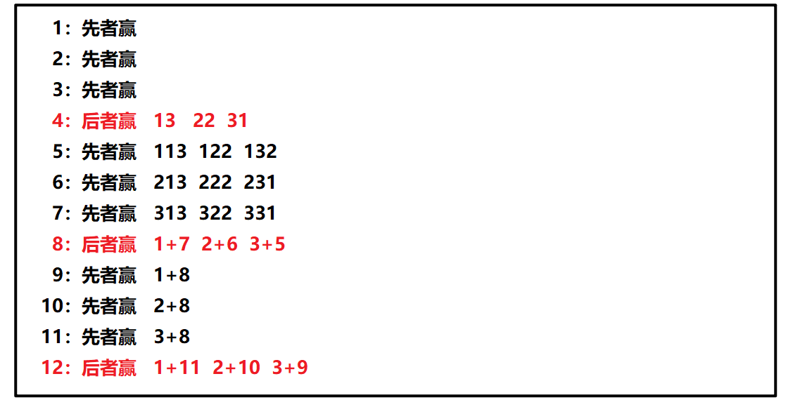

# 接雨水/容器盛水问题

给定一个整形数组arr，已知其中所有的值都是非负的，将这个数组看作一个容器，请返回容器能装多少水。

示例：

输入：3,1,2,5,2,4

输出：5


**我的思路：**

- 一个位置的液柱高度只取决于三个因素：左边最高多高、右边最高多高、底多高，所以：

- 从左向右遍历，记录左边最高多高（不算该位置）；再从右向左遍历，记录右边最高多高
- 最后较低的边沿减去底就是当前液柱大小

```cpp
class Solution {
public:
    int trap(vector<int>& height) 
    {
        //记录容器两边边沿
        int size = height.size();
        if(size <= 2)   return 0;

        //从左到右遍历，记录当前柱子左边的最大值
        vector<int> LeftMax(size, 0);
        LeftMax[0] = height[0];
        for(int i = 1; i < size; ++i)
        {
            LeftMax[i] = max(LeftMax[i-1], height[i-1]);
        }

        //从右到左遍历，记录当前柱子右边的最大值
        vector<int> RightMax(size, 0);
        RightMax[size-1] = height[size-1];
        for(int i = size-2; i >= 0; --i)
        {
            RightMax[i] = max(RightMax[i+1], height[i+1]);
        }

        //计算每一个柱子的容积
        int sum = 0;
        for(int i = 0; i < size; ++i)
        {
            if(height[i] < LeftMax[i] && height[i] <RightMax[i])
            {
                sum += (min(LeftMax[i], RightMax[i]) - height[i]);
            }
        }
        return sum;
    }
};
```

# Nim游戏

你和你的朋友，两个人一起玩 Nim 游戏：

桌子上有一堆石头。你们轮流进行自己的回合，你作为先手。
每一回合，轮到的人拿掉 1 - 3 块石头。拿掉最后一块石头的人就是获胜者。

假设你们每一步都是最优解。请编写一个函数，来判断你是否可以在给定石头数量为 n 的情况下赢得游戏。如果可以赢，返回 true；否则，返回 false 。

 ```shell
输入：n = 4
输出：false 
解释：如果堆中有 4 块石头，那么你永远不会赢得比赛；
     因为无论你拿走 1 块、2 块 还是 3 块石头，最后一块石头总是会被你的朋友拿走。
 ```

**我的思路：**

- 能被4整除就是后者赢，其他情况都是先者赢

 

```cpp
class Solution {
public:
    bool canWinNim(int n) 
    {
        if(n%4 == 0)
        {
            return false;
        }
        return true;
    }
};
```

## 