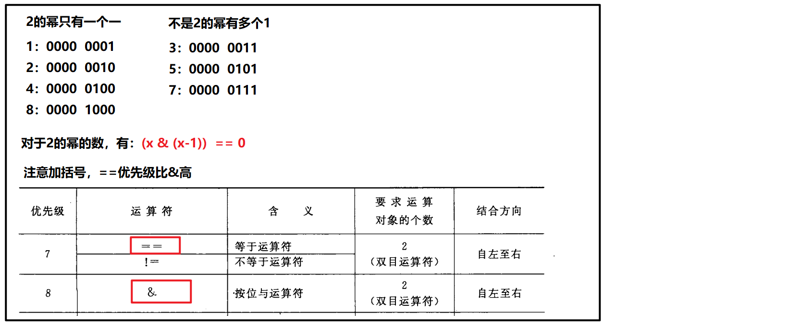
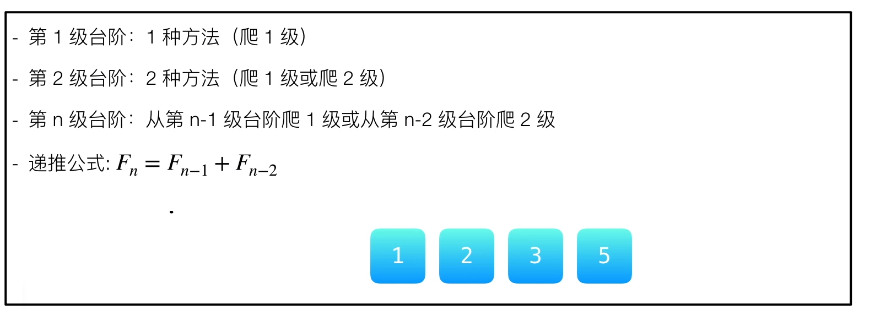
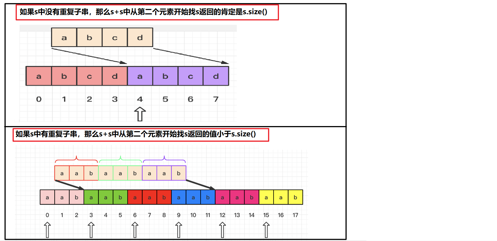

# 3.11

## 数字字符串相加

给定两个字符串形式的非负整数 `num1` 和`num2` ，计算它们的和。

我的思路：

- 从后往前遍历，相加（就像手算），注意进位

```cpp
char * addStrings(char * num1, char * num2)
{
	//"123146" + "34567" = "157713"
	
	int len1 = strlen(num1);
	int len2 = strlen(num2);
	int len3 = len1 >= len2 ? len1 + 1 : len2 + 1;
	char *rt = (char*)malloc(sizeof(char)*(len3 + 2));
	
    int b = 0;  //进位
	rt[len3 + 1] = '\0';
	len1--;
	len2--;
    
	//从后面开始遍历相加
	while (len1 >= 0 && len2 >= 0)
	{
		rt[len3] = (num1[len1] - '0' + num2[len2] - '0' + b) % 10 + '0';

		if (num1[len1] + num2[len2] + b - 2 * '0' > 9)
		{
			b = 1;  //需要往前进位
		}
		else
		{
			b = 0;
		}
		len1--;
		len2--;
		len3--;
	}
    //处理剩余的
	while (len1 >= 0)
	{
		if (num1[len1] + b - '0' > 9)
		{
			rt[len3--] = (num1[len1--] + b - '0') % 10 + '0';
			b = 1;
		}
		else
		{
			rt[len3--] = (num1[len1--] + b - '0') % 10 + '0';
			b = 0;
		}

	}
	while (len2 >= 0)
	{
		if (num2[len2] + b - '0' > 9)
		{
			rt[len3--] = (num2[len2--] + b - '0') % 10 + '0';
			b = 1;
		}
		else
		{
			rt[len3--] = (num2[len2--] + b - '0') % 10 + '0';
			b = 0;
		}
	}
	
	if (b != 0)
	{
		rt[len3--] = '1';
	}
    
	return &rt[len3 + 1];
}
```

## 编程：多项式合并

```cpp
x^2y*x^4y^3 = x^6y^4  
```

我的思路：

- 遍历字符串，将每个变量对应的指数存在unordered_map中(key-value)，最后再返回按规则组合的新的字符串

```cpp
//合并多项式  x^2y*x^4y^3 = x^6y^4   (多项式可能是3元、4元的)

#include <string.h>
#include <unordered_map>
#include <iostream>
using namespace std;

char * Combined(const char * str)
{
	//遍历字符串，将每个变量对应的指数存在unordered_map中(key-value), 最后再返回按规则组合的新的字符串
	unordered_map<char, int> um;
	int index = 0;
	while (str[index] != '\0')
	{
		if (str[index] >= 'a' && str[index] <= 'z') //x^2y*x^4y^3
		{
			if (str[index + 1] == '^')
			{
				um[str[index]] += (str[index + 2] - '0');
				index += 3;
			}
			else  //index+1是另一个字母 || index+1是*  || index+1是'\0'
			{
				um[str[index]] += 1;
				index++;
			}
		}
		else if (str[index] == '*')
		{
			index++;
		}
		else
		{
			cout << "字符串不合法" << endl;
		}
	}

	//组合新字符串
	int size = um.size() * 3 + 1;
	index = 0;
	char * rt = (char*)malloc(sizeof(char) * size);
	for (auto it : um)
	{
		rt[index] = it.first;
		rt[index + 1] = '^';
		rt[index + 2] = it.second + '0';
		index += 3;
	}
	rt[index + 1] = '\0';

	return rt;
}

int main()
{
	const char * str = "x^2y*x^4y^3";
	char * rt = Combined(str);
	cout << rt << endl;
}
```

# 3.12

> 3.12-3.14腾讯精选练习50题（简单类型）

## 最长公共前缀

编写一个函数来查找字符串数组中的最长公共前缀。

如果不存在公共前缀，返回空字符串 `""`。

```cpp
输入：strs = ["flower","flow","flight"]
输出："fl"
```

**我的思路：**

- 假设最长公共前缀是第一个字符串，遍历vector中的每一个string，依次更新最长公共前缀，如果前缀已经为空，直接返回

```cpp
class Solution {
public:
    string longestCommonPrefix(vector<string>& strs) 
    {
        if(strs.empty())
        {
            return string();
        }
		
        //假设最长公共前缀是第一个字符串
        string rs(strs.front());  //初始的最长公共前缀

        //遍历vector中的每一个string，依次更新最长公共前缀，如果前缀已经为空，直接返回
        vector<string>::iterator it = strs.begin();
        it++;
        while(it != strs.end() && rs.size() > 0)
        {
            int index = 0;
            string tmp;  //存储新公共前缀
            while(index < (*it).size() && index < rs.size() && (*it)[index] == rs[index])
            {
                tmp.push_back(rs[index]);
                index++;
            }
            rs = tmp;  //更新公共前缀
            it++;
        }
        return rs;
    }
};
```

## 2的幂

给定一个整数，编写一个函数来判断它是否是 2 的幂次方。

```cpp
输入: 1
输出: true
解释: 2^0 = 1

输入: 16
输出: true
解释: 2^4 = 16
```

**我的思路1：**

- 不断除以2看是否能除尽，O(logn)

```cpp
class Solution {
public:
    bool isPowerOfTwo(int n) 
    {
        //不断除以2看是否能除尽
        while(n > 0 && n % 2 == 0)
        {
            n = n/2;
        }

        if(n == 1)  return true;
        if(n % 2 != 0)  return false;

        return false;
    }
};
```

**我的思路2：**

- 位运算，O(1)

- 

```cpp
class Solution {
public:
    bool isPowerOfTwo(int n) 
    {
        if( n <= 0) return false;
        return (n & (n-1)) == 0;   
    }
};
```

## 爬楼梯，每次1个或2个

假设你正在爬楼梯。需要 n 阶你才能到达楼顶。

每次你可以爬 1 或 2 个台阶。你有多少种不同的方法可以爬到楼顶呢？

注意：给定 n 是一个正整数。

```shell
输入： 2
输出： 2
解释： 有两种方法可以爬到楼顶。
1.  1 阶 + 1 阶
2.  2 阶


输入： 3
输出： 3
解释： 有三种方法可以爬到楼顶。
1.  1 阶 + 1 阶 + 1 阶
2.  1 阶 + 2 阶
3.  2 阶 + 1 阶
```

**我的思路：**

- 动态规划，类似于斐波那契数列
- 

```cpp
//递归实现：时间O(2^n) 空间O(n)
class Solution {
public:
    int climbStairs(int n) 
    {
        //F(n) = F(n-1) + F(n-2)
        if(n == 1)  return 1;
        if(n == 2)  return 2;
        return climbStairs(n-1) + climbStairs(n-2);
    }
};

//迭代实现：时间O(n)  空间O(1)
class Solution {
public:
    int climbStairs(int n) 
    {
        if(n <= 2)  return n;

        int a = 1;
        int b = 2;
        int sum = 0;

        for(int i = 3; i <= n; i++)
        {
            sum = a + b;
            a = b;
            b = sum;
        }
        return sum;
    }
};
```

## 青蛙跳台阶

```cpp
一只青蛙一次可以跳上1级台阶，也可以跳上2级台阶。求该青蛙跳上一个 n 级的台阶总共有多少种跳法。
答案需要取模 1e9+7（1000000007），如计算初始结果为：1000000008，请返回 1。

输入：n = 2
输出：2

输入：n = 7
输出：21
示例 3：

输入：n = 0
输出：1
```

**我的思路：**

- f(n) = f(n-1) + f(n-2)，注意本题0级台阶有1种跳法

```cpp
class Solution {
public:
    int numWays(int n) 
    {
        //跳上n级台阶的种数 = 跳上n-1级台阶的种数 + 跳上n-2级台阶的种数
        if(n <= 1)  return 1;
       
        //f(n) = f(n-1) + f(n-2)
        
        int i = 1; //0级台阶1种跳法
        int j = 1; //1级台阶1种跳法
        int k = i + j; //2级台阶2种跳法
        for(int index = 2; index<= n; ++index)
        {
            k = (i + j) % 1000000007;
            i = j;
            j = k;
        }
        return k;
    }
};
```

## 两数之和

给定一个整数数组 nums 和一个整数目标值 target，请你在该数组中找出 和为目标值 的那 两个 整数，并返回它们的数组下标。

你可以假设每种输入只会对应一个答案。但是，数组中同一个元素不能使用两遍。你可以按任意顺序返回答案。

```cpp
输入：nums = [3,2,4], target = 6
输出：[1,2]
```

**我的思路1：**

- 暴力破解：每个i分别与(i+1)...n相加之和与target比较

```cpp
class Solution {
public:
    vector<int> twoSum(vector<int>& nums, int target) 
    {
        vector<int> rt;
        for(int i = 0; i < nums.size(); i ++)
        {
            for(int j = i+1; j <nums.size(); j++)
            {
                if(nums[i] + nums[j] == target)
                {
                    rt.push_back(i);
                    rt.push_back(j);
                }
            }
        }    
        reurn rt;
    }
};
```

**我的思路2：**

- 将所有的元素存入哈希表key对应元素值，value对应元素下标，然后确定一个key，看target-key存不存在，存在的话返回这两个key的value

```cpp
class Solution {
public:
    vector<int> twoSum(vector<int>& nums, int target) 
    {
        //将所有的元素存入哈希表key对应元素值，value对应元素下标
        unordered_map<int, int> mp;
        for(int i = 0; i < nums.size(); ++i)
        {
            mp.insert({nums[i], i});////元素值-元素下标
        }

        //然后确定一个key，看target-key存不存在，存在的话返回这两个key的value
        vector<int> rt;
        for(int i = 0; i < nums.size(); ++i)
        {
            if(mp.find(target - nums[i]) != mp.end() && (mp.find(target-nums[i]))->second != i)//找到的下标不能等于自己, 例如：[3,2,4] 6  不能返回[0,0]，而要返回[1,2]
            {
                rt.push_back(i);
                rt.push_back(mp[target - nums[i]]);
                return rt;
            }
        }
        return rt;
    }
};
```

## 重复的子字符串

给定一个非空的字符串，判断它是否可以由它的一个子串重复多次构成。给定的字符串只含有小写英文字母，并且长度不超过10000。

```shell
输入: "abab"
输出: True
    
输入: "aba"
输出: False  
```

**我的思路1：**

- 假设重复子串长度为1，遍历字符串比较，然后增加子串长度，再比较，直到子串长度增加到n/2
- 注意：每次子串长度要能被全串整除，时间O(n) 空间O(1)

```cpp
class Solution {
public:
    bool repeatedSubstringPattern(string s) 
    {
        //假设重复子串长度为1，遍历字符串比较，然后增加子串长度，再比较，直到子串长度增加到n/2
        int len = s.size();  
        if(s.empty() || len == 1)  return false;
        
        int sublen = 1;
        bool flag = true;

        for(; sublen <= len/2; sublen++)  
        {
            if(len % sublen != 0)  //子串长度要能被全串整除
            {
                continue;
            }
            flag = true;  //每次重置flag
            for(int j = sublen; j < len; j ++) 
            {
                if(s[j] != s[j-sublen])
                {
                    flag = false;
                    break;
                }
            }
            if(flag)    return true;
        }
        return false;
    }
};
```

**我的思路2：**



```cpp
class Solution {
public:
    bool repeatedSubstringPattern(string s) 
    {
        //如果s中没有重复子串，那么s+s中从第二个元素开始找s返回的肯定是s.size()
        //如果s中有重复子串，那么s+s中从第二个元素开始找s返回的值小于s.size()
        return (s+s).find(s,1) != s.size();
    }
};
```

# 3.13

## 实现strStr()函数

给定一个 haystack 字符串和一个 needle 字符串，在 haystack 字符串中找出 needle 字符串出现的第一个位置 (从0开始)。如果不存在，则返回  -1。

```shell
输入: haystack = "hello", needle = "ll"
输出: 2
```

**我的思路1：**

- BF算法：遍历haystack字符串，挨个与needle匹配

```cpp
class Solution {
public:
    int strStr(string haystack, string needle) 
    {
        //遍历haystack字符串，挨个与needle匹配
        int i = 0;
        int j = 0;
        int len1 = haystack.size();
        int len2 = needle.size();

        while(i < len1 && j < len2)
        {
            if(haystack[i] == needle[j])
            {
                i++;
                j++;
            }
            else//回退到本次开始的下一个位置（i-j+1)，j回退到0
            {
                i = i - j + 1;  
                j = 0;
            }
        }
        if(j == len2)
        {
            return i - j;
        }
        else
        {
            return -1;
        }
    }
};
```

**我的思路2：**

- KMP算法：主串i不回退，j回退到k  

```cpp
void GetNext(const char* T, int * next)  //根据子串T获取它的next数组(用来存放所有的k值)
{
	int lenT = strlen(T), j = 1, k = 0;
    if(lenT == 1)   {next[0] = -1; return;}
	next[0] = -1, next[1] = 0;

	while (j + 1 < lenT)
	{
		if (k == -1 || T[k] == T[j])    next[++j] = ++k;
		else    k = next[k];//主串游标j不动，子串游标k往回退
	}
}

int KMP(const char* S, const char *T, int pos)  //S主串，T子串
{
    if(strlen(T) == 0)   return 0;
	if (S == NULL || T == NULL || pos < 0 || pos >= strlen(S))  return -1;

	int i = pos, j = 0, len1 = strlen(S), len2 = strlen(T);
	int *next = (int *)malloc(len2 * sizeof(int));
	GetNext(T, next);

	while (i < len1 && j < len2)
	{
		if (j==-1 || S[i] == T[j])
		{
			i++;
			j++;
		}
		else    
            j = next[j];
	}
	free(next);
	if (j >= len2)  return i - j;//子串走完即为查找成功
	else    return -1;
}

int strStr(char * haystack, char * needle) //hay是长的串
{
    return KMP(haystack, needle, 0);
}
```

## 存在重复元素

如果存在一值在数组中出现至少两次，函数返回 `true` 。如果数组中每个元素都不相同，则返回 `false` 。

```cpp
输入: [1,2,3,1]
输出: true
```

**我的思路：**

- 利用set的单重性，将元素全部存入set中，然后看set.size()与nums.size()是否相同

```cpp
class Solution {
public:
    bool containsDuplicate(vector<int>& nums) 
    {
        //利用set的单重性，将元素全部存入set中，然后看set.size()与nums.size()是否相同
        set<int> Set;
        for(auto it : nums)
        {
            Set.insert(it);
        }
        return Set.size() < nums.size();
    }
};
```

## 最大子序和

给定一个整数数组 `nums` ，找到一个具有最大和的连续子数组（子数组最少包含一个元素），返回其最大和。

```cpp
输入：nums = [-2,1,-3,4,-1,2,1,-5,4]
输出：6
解释：连续子数组 [4,-1,2,1] 的和最大，为 6 。
```

**我的思路：**

- 若当前元素之前的和小于0，则丢弃之前的和，重新计算和, 每次更新最大值

  

```cpp
class Solution {
public:
    int maxSubArray(vector<int>& nums) 
    {
        if(nums.empty())    return 0;

        int preSum = 0;
        int maxSum = nums[0];
        
        for(int i = 0; i < nums.size(); ++i)
        {
            if(preSum <= 0)
            { 
                preSum = nums[i];  //丢弃之前的和，重新计算和
            }
            else
            {
                preSum += nums[i];
            } 
            maxSum = max(preSum, maxSum);
        }
        return maxSum;
    }
};
```

# 3.15

## 快排 

给你一个整数数组 `nums`，请你将该数组升序排列。

```cpp
输入：nums = [5,2,3,1]
输出：[1,2,3,5]
```

**我的思路：**

- 选取一个基准（nums[0]），然后从后往前遍历，找到比基准小的填入，然后再从前往后遍历，找到比基准大的，填入
- 使用基准数据将剩余的数据分成两部分，左部分（不一定有序）都比基准小，右部分（不一定有序）都比基准大
- 分别再对左部分和右部分（至少有两个数据）进行快速排序（递归）

```cpp
/**
 * Note: The returned array must be malloced, assume caller calls free().
 */

int OneQuick(int *nums, int low, int high)
{
    //选取一个基准（nums[0]），然后从后往前遍历，找到比基准小的填入，然后再从前往后遍历，找到比基准大的，填入
    int base = nums[low];

    while(low < high)
    {
        //从后往前遍历，找到比基准小的填入
        while(high > low && nums[high] >= base)
        {
            high--;
        }
        if(nums[high] < base)
        {
            nums[low++] = nums[high];
        }

        //从前往后遍历，找到比基准大的填入
        while(low < high && nums[low] <= base)
        {
            low++;
        }
        if(nums[low] > base)
        {
            nums[high--] = nums[low];
        }
    }
    nums[low] = base;
    return low;
}

void QuickSort(int * nums, int low, int high)
{
    //使用基准数据将剩余的数据分成两部分
    int mid = OneQuick(nums, low, high);

    //分别再对左部分和右部分快排
    if(mid - low > 1)
    {
        QuickSort(nums, low, mid-1);
    }
    if(high - mid > 1)
    {
        QuickSort(nums, mid+1, high);
    }
}

int* sortArray(int* nums, int numsSize, int* returnSize)
{
    *returnSize = numsSize;
    if(nums == NULL || numsSize <= 1)   
    {
        return nums;
    }
    
    QuickSort(nums, 0, numsSize-1);
    return nums;
}
```

# 3.17

## 斐波那契数列

写一个函数，输入 n ，求斐波那契（Fibonacci）数列的第 n 项（即 F(N)）。斐波那契数列的定义如下：

F(0) = 0,   F(1) = 1
F(N) = F(N - 1) + F(N - 2), 其中 N > 1.
斐波那契数列由 0 和 1 开始，之后的斐波那契数就是由之前的两数相加而得出。0 1 1 2 3 5

答案需要取模 1e9+7（1000000007），如计算初始结果为：1000000008，请返回 1。

````cpp
输入：n = 2
输出：1

输入：n = 5
输出：5
````

**我的思路1：**

- 递归：F(0) = 0,   F(1) = 1，F(N) = F(N - 1) + F(N - 2), 其中 N > 1.（超时）

```cpp
class Solution {
public:
    int fib(int n) 
    {
        if(n == 0)  return 0;
        if(n == 1)  return 1;
        return fib(n-1) + fib(n-2);
    }
};
```

**我的思路2：**

- 迭代：q=i+j，每次更新i，j

```cpp
//0 1 1 2 3 5 8 
//i j q
//    index 
```

```cpp
class Solution {
public:
    int fib(int n) 
    {
        if(n <= 1)  return n;

        //0 1 1 2 3 5 8 
        //i j q
        //    index 
        int i = 0;
        int j = 1;
        int q = i + j;
        for(int index = 2; index <= n; index++)
        { 
            q = (i + j)% 1000000007;
            i = j;
            j = q;
        }
        return q;
    }
};
```

## 加一

给定一个由 整数 组成的 非空 数组所表示的非负整数，在该数的基础上加一。

最高位数字存放在数组的首位， 数组中每个元素只存储单个数字。

你可以假设除了整数 0 之外，这个整数不会以零开头。

 ```cpp
输入：digits = [1,2,3]
输出：[1,2,4]
解释：输入数组表示数字 123。
    
输入：digits = [4,3,2,1]
输出：[4,3,2,2]
 ```

**我的思路：**

- 从后往前遍历，加1，注意进位，最后要看最高位是否需要进位

```cpp
class Solution {
public:
    vector<int> plusOne(vector<int>& digits) 
    {
        if(digits.empty())  return digits;
        int index = digits.size() - 1;
        bool b = true; //是否需要进位

        while(b && index >= 0)
        {
            if(digits[index] + 1 > 9)   b = true;
            else    b = false;
            digits[index] = (digits[index] + 1) % 10;
            index--;
        }
        if(b) //最高位需要进位
        {
            digits.insert(digits.begin(), 1);
        }
        return digits; 
    }
};
```

## 两个链表的第一个公共结点

输入两个链表，找出它们的第一个公共节点。

如下面的两个链表**：**

[ ](https://assets.leetcode-cn.com/aliyun-lc-upload/uploads/2018/12/14/160_statement.png)

在节点 c1 开始相交。

**我的思路：**

- 先求两个链表长度的差值，让长的链表指针先走这个差值，然后两个链表同时往后走，每次判断是否相等

```cpp
class Solution {
public:
    ListNode *getIntersectionNode(ListNode *headA, ListNode *headB) 
    {
        if(headA == nullptr || headB == nullptr)    return nullptr;
        //先计算差值
        ListNode * l1 = headA;
        ListNode * l2 = headB;
        int len1 = 0;
        int len2 = 0;
        while(l1 != nullptr)
        {
            l1 = l1->next;
            len1++;
        }  
        while(l2 != nullptr)
        {
            l2 = l2->next;
            len2++;
        }
        int sub = len1 > len2 ? len1 - len2 : len2 - len1;//差值
        ListNode * lon = len1 >= len2? headA : headB;
        ListNode * sho = len1 < len2? headA : headB;
        //长链表走差值
        while(sub)
        {
            lon = lon->next;
            sub--;
        }
        //两个链表同时走
        while(lon != nullptr && sho != nullptr && lon != sho)
        {
            lon = lon->next;
            sho = sho->next;
        }
        return lon;
    }
};
```

## 数组中数字出现的次数

在一个数组 `nums` 中除一个数字只出现一次之外，其他数字都出现了三次。请找出那个只出现一次的数字。

```cpp
输入：nums = [3,4,3,3]
输出：4
```

**我的思路：**

- 利用哈希表，将每一个数字出现的次数存起来，最后遍历哈希表，返回出现一次的数字

```cpp
class Solution {
public:
    int singleNumber(vector<int>& nums) 
    {
        //利用哈希表，将每一个数字出现的次数存起来
        unordered_map<int, int> umap;
        for(int i = 0; i < nums.size(); ++i)
        {
            umap[nums[i]] += 1;
        }
        for(auto it : umap)
        {
            if(it.second == 1)
            {
                return it.first;
            }
        }
        return -1;
    }
};
```

## 左旋转字符串

字符串的左旋转操作是把字符串前面的若干个字符转移到字符串的尾部。请定义一个函数实现字符串左旋转操作的功能。比如，输入字符串"abcdefg"和数字2，该函数将返回左旋转两位得到的结果"cdefgab"。

```cpp
输入: s = "abcdefg", k = 2
输出: "cdefgab"

输入: s = "lrloseumgh", k = 6
输出: "umghlrlose"
```

**我的思路：**

- 把s[n-1]之后的字符拷贝到新字符串，再把s[0]到s[n-1]的拷贝到新字符串后面

```cpp
class Solution {
public:
    string reverseLeftWords(string s, int n) 
    {
        ，再把s[0]到s[n-1]的拷贝到新字符串后面
        string rt;
        int size = s.size();
        rt.reserve(size);
		
        //把s[n-1]之后的字符拷贝到新字符串
        for(int i = n; i < size; ++i)
        {
            rt.push_back(s[i]);
        }
        //再把s[0]到s[n-1]的拷贝到新字符串后面
        for(int i = 0; i < n; ++i)
        {
            rt.push_back(s[i]);
        }
        return rt;
    }
};
```

# 3.18

## 二叉树的镜像翻转

```cpp
请完成一个函数，输入一个二叉树，该函数输出它的镜像。

     4
   /   \
  2     7
 / \   / \
1   3 6   9
镜像输出：

     4
   /   \
  7     2
 / \   / \
9   6 3   1
    
输入：root = [4,2,7,1,3,6,9]
输出：[4,7,2,9,6,3,1]
```

**我的思路：**

- 递归解法：前序遍历，遍历到一个结点就交换其左右孩子，然后继续遍历左子树，右子树

- 非递归解法：非递归解法：利用栈，交换当前结点左右孩子，将结点的左孩子与右孩子分别入栈，再出栈一个交换

```cpp
class Solution {
public:
    TreeNode* mirrorTree(TreeNode* root) 
    {
        /*递归解法：
        if(root == nullptr) return root;
        
        TreeNode* tmp = root->left;
        root->left = root->right;
        root->right = tmp;
        
        mirrorTree(root->left);
        mirrorTree(root->right);
        return root;
        */

        //非递归解法：利用栈，交换当前结点左右孩子，将结点的左孩子与右孩子分别入栈，再出栈一个交换
        if(root == nullptr) return root;
        stack<TreeNode*> st;
        st.push(root);
        
        while(!st.empty())
        {
            TreeNode* node = st.top();
            st.pop();

            TreeNode* tmp = node->left;
            node->left = node->right;
            node->right = tmp;

            if(node->left != nullptr) 
            {
                st.push(node->left);
            }
            if(node->right != nullptr)
            {
                st.push(node->right);
            }
            
        }
        return root;
    }
};
```

## 二叉搜索树的第k大结点

```cpp
给定一棵二叉搜索树，请找出其中第k大的节点。

输入: root = [3,1,4,null,2], k = 1
   3
  / \
 1   4
  \
   2
输出: 4
```

**我的思路：**

- 中序遍历二叉搜索树就可以把BST树从小到大输出，然后输出倒数第k个数据

```cpp
class Solution {
public:
    //中序遍历
    void LDR(TreeNode* root, vector<int> &vec)
    {
        if(root == nullptr)
        {
            return;
        }
        LDR(root->left, vec);
        vec.push_back(root->val);
        LDR(root->right, vec);
    }

    int kthLargest(TreeNode* root, int k) 
    {
        //中序遍历二叉搜索树就可以把BST树从小到大输出，然后输出倒数第k个数据
        vector<int> vec;
        LDR(root, vec);
        return vec[vec.size() - k];
    }
};
```

# 3.19

## 删除二叉搜索树中的结点

```cpp
给定一个二叉搜索树的根节点 root 和一个值 key，删除二叉搜索树中的 key 对应的节点，并保证二叉搜索树的性质不变。返回二叉搜索树（有可能被更新）的根节点的引用。

一般来说，删除节点可分为两个步骤：

首先找到需要删除的节点；如果找到了，删除它。
说明： 要求算法时间复杂度为 O(h)，h 为树的高度。

root = [5,3,6,2,4,null,7]
key = 3
    5
   / \
  3   6
 / \   \
2   4   7

给定需要删除的节点值是 3，所以我们首先找到 3 这个节点，然后删除它。
一个正确的答案是 [5,4,6,2,null,null,7], 如下图所示。

    5
   / \
  4   6
 /     \
2       7

另一个正确答案是 [5,2,6,null,4,null,7]。

    5
   / \
  2   6
   \   \
    4   7
```

**我的思路：**

- 情况1：删除的结点没有孩子，将其父结点地址域置为nullptr
- 情况2：删除的结点有一个孩子，写入父结点地址域
- 情况3：删除的结点有两个孩子，找其前驱，把前驱写入要删除的结点，再删除前驱

```cpp
class Solution {
public:
    TreeNode* deleteNode(TreeNode* root, int key) 
    {
        //情况1：删除的结点没有孩子，将其父结点地址域置为nullptr
        //情况2：删除的结点有一个孩子，写入父结点地址域
        //情况3：删除的结点有两个孩子，找其前驱，把前驱写入要删除的结点，再删除前驱

        //先找到key，同时要保存key的父结点
        TreeNode * cur = root;
        TreeNode * par = nullptr;
        while(cur != nullptr)
        {
            if(key > cur->val)
            {
                par = cur;
                cur = cur->right;
            }
            else if(key < cur->val)
            {
                par = cur;
                cur = cur->left;
            }
            else
            {
                break;
            }
        } //出循环后，cur就是要删除的结点，par是其父结点

        //没找到要删除的结点
        if(cur == nullptr)
        {
            return root;
        }

        //情况3：删除的结点有两个孩子，找其前驱，把前驱写入要删除的结点，再删除前驱
        TreeNode* pre = nullptr;
        if(cur->left != nullptr && cur->right != nullptr)
        {
            par = cur;
            pre = cur->left;
            while(pre->right != nullptr)
            {
                par = pre;
                pre = pre->right;
            }
            //把前驱写入要删除的结点
            cur->val = pre->val; 
            cur = pre;//一会要删除pre，这里赋值方便统一处理
        }

        //情况1、2：将cur的孩子写入其父结点地址域
        TreeNode *child = cur->left;
        if(cur->left == nullptr)
        {
            child = cur->right;
        }
        if(par == nullptr)//删除的是根节点，根节点par结点为空，所以要特殊处理
        {
            root = child;
        }
        else
        {
            if(cur->val > par->val)
            {
                par->right = child;
            }
            else
            {
                par->left = child;
            }
        }
      
        //删除要删除的结点
        delete cur;
        return root;
    }
};
```

## 二叉搜索树中的搜索

```cpp
给定二叉搜索树（BST）的根节点和一个值。 你需要在BST中找到节点值等于给定值的节点。 返回以该节点为根的子树。 如果节点不存在，则返回 NULL。

例如，

给定二叉搜索树:

        4
       / \
      2   7
     / \
    1   3

和值: 2
你应该返回如下子树:

      2     
     / \   
    1   3
在上述示例中，如果要找的值是 5，但因为没有节点值为 5，我们应该返回 NULL。
```

**我的思路：**

- 从root开始，val比当前节点大，就在右边继续找，val比当前结点小，就在左边继续找

```cpp
//非递归
class Solution {
public:
    TreeNode* searchBST(TreeNode* root, int val) 
    {
        //从root开始，val比当前节点大，就在右边继续找，val比当前结点小，就在左边继续找
        TreeNode *cur = root;
        while(cur != nullptr)
        {
            if(val > cur->val)
            {
                cur = cur->right;
            }
            else if(val < cur->val)
            {
                cur = cur->left;
            }
            else
            {
                break;
            }
        }
        return cur;
    }
};

//递归
class Solution {
public:
    TreeNode* searchBST(TreeNode* root, int val) 
    {
        //从root开始，val比当前节点大，就在右边继续找，val比当前结点小，就在左边继续找
        while(root != nullptr)
        {
            if(val > root->val)
            {
                return searchBST(root->right, val);
            }
            else if(val < root->val)
            {
                return searchBST(root->left, val);
            }
            else
            {
                return root;
            }
        }
        return root;
    }
};
```

## 从上到下打印二叉树

```cpp
从上到下打印出二叉树的每个节点，同一层的节点按照从左到右的顺序打印。
给定二叉树: [3,9,20,null,null,15,7],
    3
   / \
  9  20
    /  \
   15   7
返回：[3,9,20,15,7]
```

**我的思路：**

- 层序遍历：先求出二叉树的层数，然后深度遍历二叉树，到某一层就输出某一层的结点

```cpp
class Solution {
private:
    vector<int> vec;
public:
    //二叉树的层数：左子树与右子树的层数最大值+1
    int high(TreeNode * root)
    {
        if(root == nullptr)
            return 0;
        return max(high(root->left)+1, high(root->right)+1);
    }

    //深度遍历二叉树，到某层就把某一层结点输出
    void levelOrder(TreeNode *root, int i)
    {
        if(root == nullptr)
        {
            return;
        }
        if(i == 0)
        {
            vec.push_back(root->val);
            return;
        }
        levelOrder(root->left, i -1);
        levelOrder(root->right, i - 1);
    }

    //先求出二叉树的层数，然后深度遍历二叉树，到某一层就输出某一层的结点
    vector<int> levelOrder(TreeNode* root) 
    {
        if(root == nullptr) return vec;

        int h = high(root);
        for(int i = 0; i< h; ++i)
        {
            levelOrder(root, i);
        }
        return vec;
    }
};
```

## 从上到下打印二叉树II

```cpp
从上到下按层打印二叉树，同一层的节点按从左到右的顺序打印，每一层打印到一行。
例如:
给定二叉树: [3,9,20,null,null,15,7],

    3
   / \
  9  20
    /  \
   15   7
返回其层次遍历结果：

[
  [3],
  [9,20],
  [15,7]
]
```

**我的思路：**

- 层序遍历：先求出二叉树的层数，然后深度遍历二叉树，到某一层就输出某一层的结点到第层数个vector

```cpp
class Solution {
private:
    vector<vector<int>> vec;
public:
    //二叉树的层数：左子树与右子树的层数最大值+1
    int high(TreeNode * root)
    {
        if(root == nullptr)
            return 0;
        return max(high(root->left)+1, high(root->right)+1);
    }

    //深度遍历二叉树，到某层就把某一层结点输出
    void levelOrder(TreeNode *root, int i, vector<int>& xvec)
    {
        if(root == nullptr)
        {
            return;
        }
        if(i == 0)
        {
            xvec.push_back(root->val);
            return;
        }
        levelOrder(root->left, i -1, xvec);
        levelOrder(root->right, i - 1, xvec);
    }

    //先求出二叉树的层数，然后深度遍历二叉树，到某一层就输出某一层的结点
    vector<vector<int>> levelOrder(TreeNode* root) 
    {
        if(root == nullptr) return vec;

        int h = high(root);
        vec.resize(h);  //resize开辟空间同时构建对象，因为下面要用vec[i]

        for(int i = 0; i< h; ++i)
        {
            levelOrder(root, i, vec[i]);
        }
        return vec;
    }
};
```

## 从上到下打印二叉树III

```cpp
请实现一个函数按照之字形顺序打印二叉树，即第一行按照从左到右的顺序打印，第二层按照从右到左的顺序打印，第三行再按照从左到右的顺序打印，其他行以此类推。

给定二叉树: [3,9,20,null,null,15,7],

    3
   / \
  9  20
    /  \
   15   7
返回其层次遍历结果：
[
  [3],
  [20,9],
  [15,7]
]

```

**我的思路：**

- 先求出二叉树的层数，然后深度遍历二叉树，到某一层就把这层的结点存入对应的数组
- 最后将需要逆置的数组进行逆置

```cpp
class Solution {
private:
    vector<vector<int>> vec;
public:
    int high(TreeNode* root) //求二叉树的深度：左子树与右子树深度的最大值再加1
    {
        if(root == nullptr) return 0;
        return max(high(root->left), high(root->right)) + 1;
    }

    void levelOrder(TreeNode* root, int i, vector<int> & xvec)
    {
        if(root == nullptr)
        {
            return;
        }
        if(i == 0)
        {
            xvec.push_back(root->val);
        }
        levelOrder(root->left, i-1, xvec);
        levelOrder(root->right, i - 1, xvec);
    }

    vector<vector<int>> levelOrder(TreeNode* root) 
    {
        //先求出二叉树的层数，然后深度遍历二叉树，到某一层就把这层的结点存入对应的数组，
        if(root == nullptr) return vec;
        int h = high(root);
        //初始化vec（构建对象）
        vec.resize(h);

        for(int i = 0; i < h; ++i)
        {
            levelOrder(root, i, vec[i]);
        }

        //将需要逆置的数组内部进行逆置
        for(int i = 0 ; i < h; ++i)
        {
            if(i % 2 != 0)
            {
                //逆置
                int start = 0;
                int end = vec[i].size() - 1;
                while(start < end)
                {
                    int tmp = vec[i][start];
                    vec[i][start] = vec[i][end];
                    vec[i][end] = tmp;
                    start++;
                    end--;
                }
            }
        }
        return vec;
    }
};
```

## 最小的k个数

```cpp
输入整数数组 arr ，找出其中最小的 k 个数。例如，输入4、5、1、6、2、7、3、8这8个数字，则最小的4个数字是1、2、3、4。

输入：arr = [3,2,1], k = 2
输出：[1,2] 或者 [2,1]

输入：arr = [0,1,2,1], k = 1
输出：[0]
```

**我的思路1：**

- 大根堆：要找最小的前k个，维护一个大根堆，里面存前k个数字，然后遍历数组，比堆顶小的，换入

```cpp
class Solution {
public:
    //要找最小的前k个，维护一个大根堆，里面存前k个数字，然后遍历数组，比堆顶小的，换入
    vector<int> getLeastNumbers(vector<int>& arr, int k) 
    {
        if(k <= 0)  return vector<int>();
        //存前k个数字
        priority_queue<int> pq; //优先级队列默认由大到小排列
        int i = 0;
        while(i < k)
        {
            pq.push(arr[i]);
            i++;
        }

        //遍历数组，比堆顶小的，换入
        int size = arr.size();
        while(i < size)
        {
            if(arr[i] < pq.top())
            {
                pq.pop();
                pq.push(arr[i]);
            }
            i++;
        }

        //将优先级队列导入vector
        vector<int> rt;
        while(!pq.empty())
        {
            rt.push_back(pq.top());
            pq.pop();
        }
        return rt;
    }
};
```

**我的思路2：**

- 使用快排分割函数
- 要找最小的前k个，使用快排分割，每次用一个基准进行一次快排，一次快排过后，基准左边都是比基准小的，右边都是大的
- 然后看基准的下标是不是k-1，是的话，结束，不是的话看基准位置比k大还是比k小，
- 比k小那么下次在右部分再进行一次快排，比k大下次在左部分继续快排分割

```cpp
class Solution {
public:
    //要找最小的前k个，使用快排分割，每次用一个基准进行一次快排，一次快排过后，基准左边都是比基准小的，右边都是大的
    //然后看基准的下标是不是k-1，是的话，结束，不是的话看基准位置比k大还是比k小，
    //比k小那么下次在右部分再进行一次快排，比k大下次在左部分继续快排分割
    
    int partation(vector<int> & arr, int low, int high, int k)//快排分割函数
    {
        int base = arr[low]; // 选取基准
        while(low < high)
        {
            while(low < high && arr[high] >= base)
            {
                high--;
            }
            if(low < high)
            {
                arr[low++] = arr[high];
            }
            while(low < high && arr[low] < base)
            {
                low++;
            }
            if(low < high)
            {
                arr[high--] = arr[low];
            }
        }
        arr[low] = base;
        return low;
    }

    //找到划分后基准位置刚好是k的
    int selectK(vector<int> &arr, int start, int end, int k)
    {
        int pos = partation(arr, start, end, k);
        if(pos+1 < k)
        {
            return selectK(arr, pos+1, end, k);
        }
        else if(pos+1 > k)
        {
            return selectK(arr, start, pos, k);
        }
        else
        {
            return pos;
        }
    }

    vector<int> getLeastNumbers(vector<int>& arr, int k) 
    {
        if(k<=0)    return vector<int>();

        selectK(arr, 0, arr.size()-1, k);
        
        //现在数组的前k个就是最小的
        arr.resize(k);
        return arr;
    }
};
```

# 3.20

## 二叉树的前序遍历

给你二叉树的根节点 `root` ，返回它节点值的 **前序** 遍历。

**我的思路1：**

- 递归：根，前序遍历左子树，前序遍历右子树

```cpp
class Solution {
public:
    void preorderTraversal(TreeNode* root, vector<int> & vec)
    {
        if(root == nullptr)
        {
            return;
        }
        vec.push_back(root->val);
        preorderTraversal(root->left, vec);
        preorderTraversal(root->right, vec);
        return;

    }
    vector<int> preorderTraversal(TreeNode* root) 
    {
        //前序遍历：根，前序遍历左子树，前序遍历右子树
        vector<int> vec;
        preorderTraversal(root, vec);
        return vec;
    }
};
```

**我的思路2：**

- 非递归：前序遍历：根左右，根节点入栈，栈不为空，出栈输出，然后右节点入栈，左节点入栈

```cpp
class Solution {
public:
    vector<int> preorderTraversal(TreeNode* root) 
    {
        //前序遍历：根左右
        //根节点入栈，栈不为空，出栈输出，然后右节点入栈，左节点入栈
        if(root == nullptr)
        {
            return vector<int>();
        }
        
        vector<int> vec;

        stack<TreeNode*> st;
        st.push(root);

        while(!st.empty())
        {
            TreeNode* cur = st.top();
            st.pop();
            vec.push_back(cur->val);
            
            if(cur->right != nullptr)
            {
                st.push(cur->right);
            }
            if(cur->left != nullptr)
            {
                st.push(cur->left);
            }
        }
        return vec;
    }
};
```

## 二叉树的中序遍历

给你二叉树的根节点 `root` ，返回它节点值的 **中序** 遍历。

**我的思路1：**

- 递归：中序遍历左子树，根，中序遍历右子树

```cpp
class Solution {
public:
    void inorderTraversal(TreeNode* root, vector<int> & vec)
    {
        if(root == nullptr) 
        {
            return;
        }
        inorderTraversal(root->left, vec);
        vec.push_back(root->val);
        inorderTraversal(root->right, vec);
    }
    vector<int> inorderTraversal(TreeNode* root) 
    {
        if(root == nullptr)
        {
            return vector<int>();
        }

        vector<int> vec;
        inorderTraversal(root, vec);
        return vec;
    }
};
```

**我的思路2：**

- 非递归：左边的有就一直入栈，左边到底了，输出栈顶，看其右孩子有没有，有的话就入栈继续

```cpp
class Solution {
public:
    vector<int> inorderTraversal(TreeNode* root) 
    {
        //左边的有就一直入栈，到空的时候输出栈顶，看该节点右边有没有，有的话就入栈，继续
        if(root == nullptr)
        {
            return vector<int>();
        }
        vector<int> vec;
        stack<TreeNode*> st;

        while(root != nullptr || !st.empty())
        {
            if(root != nullptr)//左边有就一直入栈
            {
                st.push(root);
                root = root->left;
            }
            else//左边到底了，输出栈顶，看右边的有没有，有的话就入栈继续
            {
                TreeNode* top = st.top();
                st.pop();
                vec.push_back(top->val);

                root = top->right;
            }
        }
        return vec;
    }
};
```

## 二叉树的后序遍历

给定一个二叉树，返回它的 **后序** 遍历。

**我的思路1：**

- 递归：后序左子树，后序右子树，根

```cpp
class Solution {
public:
    void postorderTraversal(TreeNode* root, vector<int> & vec)
    {
        if(root == nullptr)
        {
            return;
        }
        postorderTraversal(root->left, vec);
        postorderTraversal(root->right, vec);
        vec.push_back(root->val);
        return;
    }

    vector<int> postorderTraversal(TreeNode* root) 
    {
        if(root == nullptr)
        {
            return vector<int>();
        }

        vector<int> vec;
        postorderTraversal(root, vec);

        return vec;
    }
};
```

**我的思路2：**

- 非递归：左右根，先求出根右左的序列，再逆序输出
- 求根右左，类似于前序遍历，根节点入栈，出栈并输出，左孩子入栈，右孩子入栈，栈顶出栈，继续左入，右入
- 最后把输出结果导出到vector中

```cpp
class Solution {
public:
    vector<int> postorderTraversal(TreeNode* root) 
    {
        //非递归：左右根，先求出根右左的序列，再逆序输出
        if(root == nullptr)
        {
            return vector<int>();
        }

        //求根右左，类似于前序遍历，根节点入栈，出栈并输出，左孩子入栈，右孩子入栈，栈顶出栈，继续左入，右入
        vector<int> vec;
        stack<TreeNode*> sta;  
        stack<int> rst;//存输出结果的栈

        sta.push(root);
        while(!sta.empty())
        {
            TreeNode* top = sta.top();
            sta.pop();
            rst.push(top->val);

            if(top->left != nullptr)
            {
                sta.push(top->left);
            }
            if(top->right != nullptr)
            {
                sta.push(top->right);
            }
        }

        while(!rst.empty())
        {
            vec.push_back(rst.top());
            rst.pop();
        }
        return vec;
        
    }
};
```

## 二叉树的层序遍历

```cpp
从上到下打印出二叉树的每个节点，同一层的节点按照从左到右的顺序打印。
给定二叉树: [3,9,20,null,null,15,7],

    3
   / \
  9  20
    /  \
   15   7
返回：
[3,9,20,15,7]
```

**我的思路：**

- 递归：[从上到下打印二叉树](##从上到下打印二叉树)
- 非递归：广度优先遍历，用队列，根节点入队列，出队列，左孩子入队，右孩子入队，出队，左入，右入，出

```cpp
//非递归代码
class Solution {
private:
    vector<int> vec;
public:
    //广度优先遍历，用队列，根节点入队列，出队列，左孩子入队，右孩子入队，出对列，左入，右入，出
    vector<int> levelOrder(TreeNode* root) 
    {
        if(root == nullptr)
        {
            return vector<int>();
        }
        queue<TreeNode*> que;
        que.push(root);

        vector<int> vec;

        while(!que.empty())
        {
            TreeNode* front = que.front();
            que.pop();
            vec.push_back(front->val);

            if(front->left != nullptr)
            {
                que.push(front->left);
            }
            if(front->right != nullptr)
            {
                que.push(front->right);
            }
        }
        return vec;
    }
};
```

## 二叉树的最近公共祖先

给定一个二叉树, 找到该树中两个指定节点的最近公共祖先。

百度百科中最近公共祖先的定义为：“对于有根树 T 的两个节点 p、q，最近公共祖先表示为一个节点 x，满足 x 是 p、q 的祖先且 x 的深度尽可能大（一个节点也可以是它自己的祖先）。”

 

```cpp
输入：root = [3,5,1,6,2,0,8,null,null,7,4], p = 5, q = 1
输出：3
解释：节点 5 和节点 1 的最近公共祖先是节点 3 。
```

**我的思路：**

- 深度优先遍历，在二叉树中找到两个节点的路径，分别存入两个数组，然后找两个数组的分叉点

- 二叉树中找节点的路径：从顶向下找，记录路径，到底部的时候，弹出一个，继续找，找到的话修改标记，没必要继续遍历

> 这道题找路径的方法类似于这道题：[二叉树中和为某一值的路径](##二叉树中和为某一值的路径)

```cpp
class Solution {
private:
    vector<TreeNode*> path_p;
    vector<TreeNode*> path_q;
    bool flag = false;
public:
    //深度优先遍历(类似前序，但每次要更新路径)在二叉树中找到结点key的路径，并返回路径到path
    void findPath(TreeNode* root, TreeNode* key, vector<TreeNode*>& path)
    {
        if (root == nullptr || key == nullptr || flag)
        {
            return;
        }

        path.push_back(root);
        if (root == key)
        {
            flag = true;// 已经找到
            return;
        }
        if (root->left == nullptr && root->right == nullptr)  //遍历到底了，弹出一个，回溯
        {
            path.pop_back();
            return;
        }
        findPath(root->left, key, path);
        findPath(root->right, key, path);
        if (!path.empty() && !flag)//每次遍历完一个结点的左右子树，如果没有成功找到，回溯的时候要从路径中剔除该结点
        {
            path.pop_back();
        }
        return;
    }

    TreeNode* lowestCommonAncestor(TreeNode* root, TreeNode* p, TreeNode* q)
    {
        //深度优先遍历，在二叉树中找到两个节点的路径，分别存入两个数组，然后找两个数组的分叉点
        if (root == nullptr || p == nullptr || q == nullptr)
        {
            return nullptr;
        }

        findPath(root, p, path_p);
        flag = false;
        findPath(root, q, path_q);

        int i = 0;
        for (i = 0; i < path_p.size() && i < path_q.size(); ++i)
        {
            if (path_p[i] != path_q[i])
            {
                break;
            }
        }
        return path_p[i-1];      
    }
};
```

# 3.21

## 对称的二叉树

```cpp
请实现一个函数，用来判断一棵二叉树是不是对称的。如果一棵二叉树和它的镜像一样，那么它是对称的。

例如，二叉树 [1,2,2,3,4,4,3] 是对称的。

    1
   / \
  2   2
 / \ / \
3  4 4  3
但是下面这个 [1,2,2,null,3,null,3] 则不是镜像对称的:

    1
   / \
  2   2
   \   \
   3    3
```

**我的思路：**

- 遍历二叉树，每次看它的左孩子和右孩子是否相等
- 相等的话，看左左=右右？，左右=右左？

```cpp
class Solution {
public:
    bool isSymmetric(TreeNode* root) 
    {
        //遍历二叉树，每次看它的左孩子和右孩子是否相等
        //相等的话，看左左==右右，左右==右左
        if(root == nullptr)
        {
            return true;
        }
        return isSymmetric(root->left, root->right);
    }
    bool isSymmetric(TreeNode* left, TreeNode* right)
    {
        if(left == nullptr && right == nullptr)
        {
            return true;
        }

        if(left == nullptr || right == nullptr)//有一个是空的
        {
            return false;
        }

        if(left->val != right -> val)
        {
            return false;
        }
        
        return isSymmetric(left->left, right->right)
            && isSymmetric(left->right, right->left);
    }
};
```

## 判断是否是平衡二叉树

```cpp
输入一棵二叉树的根节点，判断该树是不是平衡二叉树。如果某二叉树中任意节点的左右子树的深度相差不超过1，那么它就是一棵平衡二叉树。

给定二叉树 [3,9,20,null,null,15,7]

    3
   / \
  9  20
    /  \
   15   7
返回 true
```

**我的思路1：**

- 遍历每个结点，回溯的时候计算左右子树高度差是否<=1

```cpp
//调用high方法，效率不好
bool isBalance(Node* node)
{
    if(node == nullptr)
    {
        return true;
	}
    if(!isBalance(node->left_))
    {
        return false;
	}
    if(!isBalance(node->right_))
    {
        return false;
    }
    
    int left = high(node->left_);//效率不好
    int right = high(node->right_);
    return abs(left-right) <= 1;
}
int high(TreeNode* root)
{
    if(root == nullptr)
    {
        return 0;
    }
    return max(high(root->left), high(root->right))+1;
}
```

**我的思路2：**

- 深度优先遍历，回溯的时候，记录每个结点对应的level

```cpp
class Solution {
private:
    bool flag = true; //true是平衡二叉树，false不是
public:
    //深度优先遍历，回溯的时候，记录每个结点对应的level
    int _isBalanced(TreeNode* root)
    {
        if(root == nullptr)
        {
            return 0;
        }
        
        int left = _isBalanced(root->left) + 1;
        if(!flag)   return left; 
        int right = _isBalanced(root->right) + 1; 
        if(!flag)   return right;

        if(abs(left - right) > 1)
        {
            flag = false;
        }
     
        return max(left, right);
    }
    bool isBalanced(TreeNode* root)
    {   
        _isBalanced(root);
        return flag;
    }
};
```

# 3.22

## 树的子结构

```cpp
输入两棵二叉树A和B，判断B是不是A的子结构。(约定空树不是任意一个树的子结构)

B是A的子结构， 即 A中有出现和B相同的结构和节点值。

例如:
给定的树 A:

     3
    / \
   4   5
  / \
 1   2
给定的树 B：

   4 
  /
 1
返回 true，因为 B 与 A 的一个子树拥有相同的结构和节点值。
```

**我的思路：**

- 先从A树中找到B树的根结点存起来，然后同时遍历根结点、B树来进行比对

- 注意：在A树中找到的结点有可能有多个，每个都要与B树进行比对

  

```cpp
class Solution {
    //先从A树中找到B树的根结点, 然后同时遍历pub和B来进行比对
public:
    bool isSubStructure(TreeNode* A, TreeNode* B) //A是大树，B是小树
    {
        if(B == nullptr)
        {
            return false;
        }

        //先从A树中找到B树的根结点，注意如果有重复的元素都要接收到
        vector<TreeNode*> vec = findRoot(A, B);

        //然后挨个用容器中的节点和B树来进行比对
        for(int i = 0; i < vec.size(); ++i)
        {
            if(isChild(vec[i], B))
            {
                return true;
            }
        }
        return false;    
    }

    //检查看pub和B是否相同
    bool isChild(TreeNode* pub, TreeNode * B)
    {
        if(pub == nullptr && B == nullptr)
        {
            return true;
        }
        if(pub == nullptr && B != nullptr)
        {
            return false;
        }
        if(pub != nullptr && B == nullptr)
        {
            return true;
        }
        if(pub->val != B->val)
        {
            return false;
        }

        return isChild(pub->left, B->left)
            && isChild(pub->right, B->right);
    }

    //在A树中找到B树的根结点并返回，有重复的都要返回
    vector<TreeNode*> findRoot(TreeNode * A, TreeNode * B)
    {
        vector<TreeNode*> vec; 
        if(B == nullptr)
        {
            return vec;
        }
        //存放找到的结点
        
        //层序遍历A来找，使用辅助队列
        queue<TreeNode*> que;
        que.push(A);

        while(!que.empty())
        {
            TreeNode* cur = que.front();
            que.pop();
            if(cur->val == B->val)
            {
                vec.push_back(cur);
            }

            if(cur->left != nullptr)
            {
                que.push(cur->left);
            }
            if(cur->right != nullptr)
            {
                que.push(cur->right);
            }
        }
        return vec;
    }
};
```

## 二叉搜索树与双向循环链表

输入一棵二叉搜索树，将该二叉搜索树转换成一个排序的循环双向链表。要求不能创建任何新的节点，只能调整树中节点指针的指向。

当转化完成以后，树中节点的左指针需要指向前驱，树中节点的右指针需要指向后继。还需要返回链表中的第一个节点的指针。


**我的思路：**

- 中序遍历二叉搜索树的到有序序列，将结果存到vector中，然后修改左右孩子指针分别指向前驱和后继
- 注意先处理0个结点和1个结点的特殊情况

```cpp
class Solution {
public:
    Node* treeToDoublyList(Node* root) 
    {
        //先处理0个结点和1个结点的特殊情况
        if(root == nullptr)//0个
        {
            return root;
        }
        if(root->left == nullptr && root->right == nullptr)//1个结点
        {
            root->left = root;
            root->right = root;
            return root;
        }

        //中序遍历该二叉搜索树，将结果存到vector中，然后修改指针指向
        vector<Node*> vec = inOrder(root);    
        int size = vec.size();

        for(int i = 0; i < size; ++i)
        {
            if(i == 0) //第一个节点的前驱是最后一个节点
            {
                vec[i]->left = vec[size - 1];
            }
            else
            {
                vec[i]->left = vec[i-1];
            }
            
            if(i == size - 1)//最后一个节点的后继是第一个节点
            {
                vec[i]->right = vec[0];
            }
            else
            {
                vec[i]->right = vec[i+1];
            }
            
        }
        return vec[0];
    }

    //中序遍历
    vector<Node*> inOrder(Node* root)
    {
        vector<Node*> vec;
        if(root == nullptr)
        {
            return vec;
        }

        Node* cur = root;
        stack<Node*> st;

        while(!st.empty() || cur != nullptr)
        {
            //左边能找到就一直往左下找        
            if(cur != nullptr)
            {
                st.push(cur);
                cur = cur->left;
            }
            else
            {
                //输出最左下的结点
                Node* top = st.top();
                vec.push_back(top);
                st.pop();
                cur = top->right;
            }       
        }
        return vec;
    }
};
```

## 旋转数组的最小数字

```cpp
把一个数组最开始的若干个元素搬到数组的末尾，我们称之为数组的旋转。输入一个递增排序的数组的一个旋转，输出旋转数组的最小元素。例如，数组 [3,4,5,1,2] 为 [1,2,3,4,5] 的一个旋转，该数组的最小值为1。  

输入：[3,4,5,1,2]
输出：1
    
输入：[2,2,2,0,1]
输出：0
```

**我的思路：**

- 二分查找
- arr[mid]比arr[high]小，在[low，mid]之间找，注意不是mid-1
- arr[mid]比arr[high]大，在[mid+1, high]找，
- arr[mid]和arr[high]相等high-1


```cpp
class Solution {
public:
    int minArray(vector<int>& arr) 
    {
        //二分查找，mid比high小，在[low，mid]之间找注意不是mid-1，比high大，在[mid+1, high]找，相等high-1
        int low = 0;
        int high = arr.size()-1;
        int mid;
        while(low < high)
        {
            mid = low + (high-low)/2;
            if(arr[mid] < arr[high])
            {
                high = mid;
            }
            else if(arr[mid] > arr[high])
            {
                low = mid + 1;
            }
            else
            {
                high--;
            }
        }
        return arr[low];
    }
};
```

## 扑克牌中的顺子

```cpp
从扑克牌中随机抽5张牌，判断是不是一个顺子，即这5张牌是不是连续的。2～10为数字本身，A为1，J为11，Q为12，K为13，而大、小王为 0 ，可以看成任意数字。A 不能视为 14。

输入: [1,2,3,4,5]
输出: True

输入: [0,0,1,2,5]
输出: True
```

**我的思路：**

- 先对这5张牌从小到大排序，然后统计0的个数，然后遍历数组看是不是连续的，遇到差值大于1的用0牌抵消，注意对0牌的消耗要及时更新

```cpp
class Solution {
public:
    bool isStraight(vector<int>& nums) 
    {
        //先对这5张牌排序
        priority_queue<int, vector<int>, greater<int>> pque;
        for(auto it : nums)
        {
            pque.push(it);
        }
        vector<int> vec;
        while(!pque.empty())
        {
            vec.push_back(pque.top());
            pque.pop();
        }

        //统计0的个数
        int i = 0;
        int count = 0;
        while(vec[i] == 0)
        {
            count++;
            i++;
        }

        //遍历数组
        while(i+1 < 5)
        {
            if(vec[i+1] - vec[i] != 1)
            {
                if(vec[i+1] - vec[i] != 0 && vec[i+1] - vec[i] <= count + 1)
                {
                    i++;
                    count = count - (vec[i+1]-vec[i]-1); //消耗掉了0牌
                }
                else
                {
                    return false;
                }
            }
            else
            {
                i++;
            }
        }
        return true;
    }
};
```

# 3.23

## 翻转单词顺序

```cpp
输入一个英文句子，翻转句子中单词的顺序，但单词内字符的顺序不变。为简单起见，标点符号和普通字母一样处理。例如输入字符串"I am a student. "，则输出"student. a am I"。

输入: "the sky is blue"
输出: "blue is sky the"
示例 2：

输入: "  hello world!  "
输出: "world! hello"
解释: 输入字符串可以在前面或者后面包含多余的空格，但是反转后的字符不能包括。
```

**我的思路：**

- 先将s按空格进行切割，存入vec中
- 将vec中的字符串逆着输出
- 最后去除字符串中多余的空格

```cpp
class Solution {
public:
    string reverseWords(string s) 
    {
        //先将s按空格进行切割，存入vec中
        vector<string> vec;
        int i = 0; //一个单词的起始位置
        int j = 0; //一个单词的结束位置
        for(; j <= s.size(); ++j)//注意size个数不包括\0
        {
            if(s[j] == ' ' || s[j] == '\0')
            {
                //把i到j的字母存入vec
                string tmp;
                while(i <= j)//空格也存入
                {
                    tmp.push_back(s[i++]);
                }
                if(s[j] == '\0')//如果是\0的话替换成空格存入
                {
                    tmp.pop_back();
                    tmp.push_back(' ');
                }
                vec.push_back(tmp);
            }
        }

        //将vec中的字符串逆着输出
        vector<string>::reverse_iterator rit = vec.rbegin();
        string str;
        for(;rit != vec.rend();++rit)
        {
            str +=*rit;
        }

        string rt = removeSpace(str); //去除多余的空格
        return rt;
    }
    
    string removeSpace(string & str)//去除str字符串中多余的空格
    {
        int i = 0;
        while(str[i] == ' ')
        {
            i++;
        }
        string rt;
        while(i <= str.size())
        {
            if(str[i] != ' ')
            {
                rt.push_back(str[i]);
                i++;
            }
            else//str[i] == ' '
            {
                if(i+1 <= str.size() && str[i+1] == ' ' || i+1 >= str.size())
                {
                    i++;
                }
                else
                {
                    rt.push_back(str[i]);
                    i++;
                }
            }
        }
        return rt;
    }
};
```

## 两数之和

```cpp
给定一个整数数组 nums 和一个整数目标值 target，请你在该数组中找出 和为目标值 的那 两个 整数，并返回它们的数组下标。
你可以假设每种输入只会对应一个答案。但是，数组中同一个元素在答案里不能重复出现。
你可以按任意顺序返回答案。

输入：nums = [2,7,11,15], target = 9
输出：[0,1]
解释：因为 nums[0] + nums[1] == 9 ，返回 [0, 1] 。
```

**我的思路：**

- 将所有元素存入unordered_map中，然后遍历一个数看target-num[i]在不在哈希表中

```cpp
class Solution {
public:
    vector<int> twoSum(vector<int>& nums, int target) 
    {
        //将所有元素存入unordered_map中，然后遍历一个数看target-num[i]在不在哈希表中
        unordered_map<int, int> umap;
        for(int i = 0; i < nums.size(); ++i)
        {
            umap.insert({nums[i], i});//元素值-下标
        }

        vector<int> ret;
        for(int i = 0; i < nums.size(); ++i)
        {
            if(umap.find(target-nums[i]) != umap.end() && umap.find(target-nums[i])->second != i)//不能找到的数是自身
            {
                ret.push_back(i);
                ret.push_back(umap.find(target-nums[i])->second);
                break;
            }
        }

        return ret;
    }
};
```

## 找出数组中重复的数字

```cpp
在一个长度为 n 的数组 nums 里的所有数字都在 0～n-1 的范围内。数组中某些数字是重复的，但不知道有几个数字重复了，也不知道每个数字重复了几次。请找出数组中任意一个重复的数字。
示例 1：
输入：
[2, 3, 1, 0, 2, 5, 3]
输出：2 或 3 
```

**我的思路1：**

- 创建一个辅助数组，一个萝卜一个坑往进放，有重复的，返回

```cpp
class Solution {
public:
    int findRepeatNumber(vector<int>& vec1) 
    {
        //创建一个辅助数组，一个萝卜一个坑往进放，有重复的，返回
        vector<int> vec2;
        vec2.resize(vec1.size(), -1);//初始化数组大小为vec1.size()，元素值为-1

        for(int i = 0; i < vec1.size(); ++i)
        {
            if(vec2[vec1[i]] == vec1[i])
            {
                return vec1[i];
            }
            else
            {
                vec2[vec1[i]] = vec1[i];
            }     
        }
        return -1;
    }
};
```

**我的思路2：**

- 原地交换入坑：因为每个数字都在0~n-1范围内，所以可以原地入坑
- 遍历数组，将元素与对应的下标的位置的元素交换，如果这两个元素相等就返回

```cpp
class Solution {
public:
    int findRepeatNumber(vector<int>& vec1) 
    {
        //因为每个数字都在0~n-1范围内，所以可以原地入坑
        //遍历数组，将元素与对应的下标的位置的元素交换，如果这两个元素相等就返回
        int i = 0;
        while(i < vec1.size())
        {
            if(vec1[i] != i)  //当前坑不匹配
            {
                if(vec1[vec1[i]] != vec1[i])//交换到对应的坑
                {
                    int tmp = vec1[vec1[i]];
                    vec1[vec1[i]] = vec1[i];
                    vec1[i] = tmp;
                }
                else//找到了重复的了，返回
                {
                    return vec1[i];
                }
            }
            else //当前坑就是对应的元素，检查下一个坑
            {
                i++;
            }
        }
        return -1;
    }
};
```

# 3.24

## 1比特与2比特字符

```cpp
有两种特殊字符。第一种字符可以用一比特0来表示。第二种字符可以用两比特(10 或 11)来表示。

现给一个由若干比特组成的字符串。问最后一个字符是否必定为一个一比特字符。给定的字符串总是由0结束。

输入: 
bits = [1, 0, 0]
输出: True
解释: 
唯一的编码方式是一个两比特字符和一个一比特字符。所以最后一个字符是一比特字符。

输入: 
bits = [1, 1, 1, 0]
输出: False
解释: 
唯一的编码方式是两比特字符和两比特字符。所以最后一个字符不是一比特字符。
```

**我的思路：**

- 看最后一个0到倒数第二个0之间有多少个1，偶数1个就是1比特，奇数个1就是2比特

```cpp
class Solution {
public:
    bool isOneBitCharacter(vector<int>& bits) 
    {
        //1比特：0
        //2比特：10  11 
        //0
        //10     2比特
        //110    1比特
        //1110   2比特
        //11110  1比特
        //看最后一个0到倒数第二个0之间有多少个1，偶数1个就是1比特，奇数个1就是2比特
        
        if(bits.empty())
        {
            return false;
        }

        int size = bits.size();

        if(bits[size-1] != 0)//最后一个元素必须是0
        {
            return false;
        }
        
        int i = size - 2;
        int count = 0; //1的个数
        while(i >= 0 && bits[i] == 1)
        {
            count++;
            i--;
        }
        return count%2==0;        
    }
};
```

## 两数相加

```cpp
给你两个 非空 的链表，表示两个非负的整数。它们每位数字都是按照 逆序 的方式存储的，并且每个节点只能存储 一位 数字。

请你将两个数相加，并以相同形式返回一个表示和的链表。

你可以假设除了数字 0 之外，这两个数都不会以 0 开头。
```

 

```cpp
输入：l1 = [2,4,3], l2 = [5,6,4]
输出：[7,0,8]
解释：342 + 465 = 807.
    
输入：l1 = [0], l2 = [0]
输出：[0]
    
输入：l1 = [9,9,9,9,9,9,9], l2 = [9,9,9,9]
输出：[8,9,9,9,0,0,0,1]
```

**我的思路1：**

- 因为是逆序存的，所以可以直接相加，每次要记得存一下是否进位
- 最后要记得处理剩余的链表，以及最后的进位

```cpp
class Solution {
public:
    ListNode* addTwoNumbers(ListNode* l1, ListNode* l2) 
    {
        //因为是逆序存的，所以可以直接相加，每次要记得存一下是否进位
        ListNode dumb;  //哑结点/头结点
        ListNode* cur = &dumb;
        int bit = 0;  //进位
        while(l1 != nullptr && l2 != nullptr)
        {
            cur->next = new ListNode((l1->val + l2->val + bit)%10);

            if(l1->val + l2->val + bit >= 10)
            {
                bit = 1;
            }
            else
            {
                bit = 0;
            }
            
            cur = cur->next;
            l1 = l1->next;
            l2 = l2->next;
        }
        //处理l1和l2剩余的
        ListNode* remain = (l1!=nullptr?l1:l2);
        while(remain != nullptr)
        {
            cur->next = new ListNode((remain->val+bit)%10);
            if(remain->val + bit >= 10)
            {
                bit = 1;
            }
            else
            {
                bit = 0;
            }
            
            cur = cur->next;
            remain = remain->next;
        }
        //处理最后的进位
        if(bit == 1)
        {
            cur->next = new ListNode(1);
        }
        return dumb.next;
    }
};
```

**我的思路2：**（后面的大数测试用例没过：大数存不下）

- 先将两个链表的数字提取出来，再相加，再存入新链表

```cpp
class Solution {
public:
    ListNode* addTwoNumbers(ListNode* l1, ListNode* l2) 
    {
        //先将两个链表的数字提取出来
        long long num1 = 0;
        long long pow = 1; //权重
        while(l1 != nullptr)
        {
            num1 = num1 + l1->val * pow;
            pow *= 10;
            l1 = l1->next;
        }
        long long num2 = 0;
        pow = 1;
        while(l2 != nullptr)
        {
            num2 = num2 + l2->val * pow;
            pow *= 10;
            l2 = l2->next;
        }

        //相加
        long long num3 = num1 + num2;

        //将相加之后的结果存入新链表
        ListNode* ret = reverseInt(num3);

        return ret;
    }

    //将数字num3逆着存入新链表 123 =>3->2->1->nullptr
    ListNode* reverseInt(long long num3)
    {
        ListNode* ret = new ListNode();  //哑结点
        ListNode* cur = ret;

        if(num3 == 0)
        {
            cur->next = new ListNode(0);
        }
        else
        {
            while(num3 != 0)
            {
                cur->next = new ListNode(num3 % 10);
                num3 /= 10;
                cur = cur->next;
            }    
        }    
        return ret->next;
    }
};
```

# 4.2

## 最长不含重复字符的子字符串

请从字符串中找出一个最长的不包含重复字符的子字符串，计算该最长子字符串的长度。

```cpp
输入: "abcabcbb"
输出: 3 
解释: 因为无重复字符的最长子串是 "abc"，所以其长度为 3。
    
输入: "pwwkew"
输出: 3
解释: 因为无重复字符的最长子串是 "wke"，所以其长度为 3。
     请注意，你的答案必须是 子串 的长度，"pwke" 是一个子序列，不是子串。
```

**我的思路：**

- 从前到后遍历字符串，并且把连续不重复的暂存到unordered_map中，不重复，存进去
- 如果出现重复，更新最大长度，清空哈希表，index回溯，再存

```cpp
class Solution {
public:
    int lengthOfLongestSubstring(string s) 
    {
        //从前到后遍历字符串，并且把连续不重复的暂存到unordered_map中，不重复，存进去
        //如果出现重复，更新最大长度，清空哈希表，index回溯，再存
        if(s.size() == 0)
            return 0;
        
        unordered_map<char, int> mp;  //字符-次数
        int maxlen = 0;
        int index = 0;

        mp[s[index]] += 1; //首字母存进去
        while(index < s.size())
        {
            if(mp[s[index]] == 0)//该字母不重复，存进去
            {
                mp[s[index]] += 1;
                index++;
            }
            else //该字母和之前的重复了，更新最大长度，清空哈希表，index回溯，再存
            {
                maxlen = mp.size() > maxlen ? mp.size() : maxlen;
                index = index - mp.size() + 1;

                mp.clear();
                mp[s[index]] += 1;
                index++;
            }
            
        }
        maxlen = mp.size() > maxlen ? mp.size() : maxlen; //处理最后一个
        return maxlen;
        
    }
};
```

# 4.3

## 剪绳子（最优拆分数字3）

```cpp
给你一根长度为 n 的绳子，请把绳子剪成整数长度的 m 段（m、n都是整数，n>1并且m>1），每段绳子的长度记为 k[0],k[1]...k[m-1] 。请问 k[0]*k[1]*...*k[m-1] 可能的最大乘积是多少？例如，当绳子的长度是8时，我们把它剪成长度分别为2、3、3的三段，此时得到的最大乘积是18。

输入: 2
输出: 1
解释: 2 = 1 + 1, 1 × 1 = 1
示例 2:

输入: 10
输出: 36
解释: 10 = 3 + 3 + 4, 3 × 3 × 4 = 36
```

**我的思路：**

- `2:1*1  3:1*2  4:2*2  5:2*3  6:3*3  7:2*2*3  8:2*3*3  9:3*3*3 10:3*3*4  11:3*3*3*2`
- 当所有拆分出的数字相等时，乘积最大；==最优拆分数字为 3==
- 当n<=3，返回n-1
- 当n%3 == 0，rt = pow(3, n/3)
- 当n%3 == 1，rt = pow(3, n/3 - 1) * 4
- 当n%3 == 2，rt = pow(3, n/3) * 2;

```cpp
class Solution {
public:
    //2:1*1  3:1*2  4:2*2  5:2*3  6:3*3  7:2*2*3  8:2*3*3  9:3*3*3 10:3*3*4 
    int cuttingRope(int  n) 
    {
        //当所有拆分出的数字相等时，乘积最大
        //最优拆分数字为 3

        if(n <= 3)  return n-1;

        //当n为3的倍数 6:3*3  9:3*3*3
        if(n % 3 == 0)      return pow(3, n/3);

        //当n%3 == 1  7:3*4  10:3*3*4  13:3*3*3*4
        if(n % 3 == 1)     return pow(3, n/3 - 1) * 4;

        //当n%3 == 2  5:3*2  8:3*3*2  11:3*3*3*2
        if(n % 3 == 2)     return pow(3, n/3) * 2;

        return 1;
    }
};
```

## 剪绳子II（大数越界的处理）

自己封装带取余的pow

```cpp
class Solution {
public:
    int cuttingRope(int n) 
    {
        if(n <= 3)  return n-1;

        if(n % 3 == 0)  return Pow(3, n/3, 1);

        if(n % 3 == 1)  return Pow(3, n/3-1, 4);

        if(n % 3 == 2)  return Pow(3, n/3, 2);

        return 1;
    }

    //x^n * c % 1000000007，自己封装的带取余的pow
    long Pow(int x, int n, int c)
    {
        long result = c;

        for(int i = 0; i < n; ++i)
        {
            result = result * x % 1000000007;
        }
        return result;
    }
};
```

## 判断二叉树是否为平衡二叉树

```cpp
实现一个函数，检查二叉树是否平衡。在这个问题中，平衡树的定义如下：任意一个节点，其两棵子树的高度差不超过 1。


示例 1:
给定二叉树 [3,9,20,null,null,15,7]
    3
   / \
  9  20
    /  \
   15   7
返回 true 。
```

**我的思路1：**

- 深度遍历二叉树到底，回溯的时候判断每个结点的左右子树的结点值高度差是否<=1

```cpp
class Solution {
public:
    bool isBalanced(TreeNode* root) 
    {
        //深度遍历二叉树到底，回溯的时候判断每个结点的左右子树的结点值高度差是否<=1
        if(root == nullptr) return true;

        if(!isBalanced(root->left)) return false;
        if(!isBalanced(root->right))    return false;   

        int lh = high(root->left);
        int rh = high(root->right);
        return abs(lh-rh) <= 1;
    }
    int high(TreeNode* root)
    {
        if(root == nullptr) return 0;

        return max(high(root->left), high(root->right)) + 1;
    }
};
```

**我的思路2：**

- 遍历二叉树，在每次递归的函数栈上记录高度
- 回溯的时候判断每个结点的左右子树的结点值高度差是否<=1

```cpp
class Solution {
public:
    bool isBalanced(TreeNode* root) 
    {
        //遍历二叉树，在每次递归的函数栈上记录高度
        bool flag = true;

        isBalanced(root, 0, flag);
        return flag;
    }

    int isBalanced(TreeNode* root, int h, bool & flag)
    {
        if(root == nullptr) return h;

        int lh = isBalanced(root->left, h+1, flag);
        if(!flag)   return lh;
        int rh = isBalanced(root->right, h+1, flag);
        if(!flag)   return rh;

        if(abs(lh - rh) > 1)
        {
            flag = false;
        }
        return max(lh, rh);
    }
};
```

# 4.4

## 判断是否为BST树后序遍历序列

```cpp
输入一个整数数组，判断该数组是不是某二叉搜索树的后序遍历结果。如果是则返回 true，否则返回 false。假设输入的数组的任意两个数字都互不相同。

参考以下这颗二叉搜索树：

     5
    / \
   2   6
  / \
 1   3

输入: [1,6,3,2,5]
输出: false
```

**我的思路：**

- 传入的后序遍历序列，排序后得到的有序数组就是中序遍历序列
- ==利用中序、后序重建二叉树，然后判断重建出来的二叉树是不是BST树==
- 中序、后序重建二叉树辅助图示：


```cpp
class Solution {
public:
    //传入的后序遍历序列，排序后得到的有序数组就是中序遍历序列
    //利用中序、后序重建二叉树，然后判断重建出来的二叉树是不是BST树
    bool verifyPostorder(vector<int>& postorder) 
    {
        //排序得到中序序列
        vector<int> inorder = postorder;
        sort(inorder.begin(), inorder.end());

        //利用中序和后序重建二叉树
        TreeNode* root = rebuild(inorder, postorder);

        //判断该二叉树是否为BST树
        return isBST(root);
    }

    //树的结点
    struct TreeNode
    {
        TreeNode(int val): data(val), left(nullptr), right(nullptr) {}
        int data;
        TreeNode* left;
        TreeNode* right;
    };

    //利用中序和后序重建二叉树，返回根结点
    TreeNode* rebuild(vector<int> & inorder, vector<int> & postorder)
    {
        TreeNode* root = rebuild(inorder, 0, inorder.size() - 1, 
                                 postorder, 0, postorder.size()-1);
        return root;
    }
    TreeNode* rebuild(vector<int> & inorder, int i, int j, 
                      vector<int> & postorder, int m, int n)
    {
        if(i > j || m > n)  //中序、后序已经遍历完毕
        {
            return nullptr;
        }
        //拿后序的第一个结点创建根节点
        TreeNode* node = new TreeNode(postorder[n]);

        //在中序序列中找到根节点，进而知道左孩子与右孩子的中序，建立左右子树的时候，再根据中序和后序去建立
        int k;
        for(k = i; k < j; ++k)
        {
            if(inorder[k] == postorder[n])
            {
                break;
            }
        }
        node->left = rebuild(inorder, i, k -1, postorder, m, m+k-i-1);
        node->right = rebuild(inorder, k+1, j, postorder, m+k-i, n-1);
        return node;
    }

    //判断root是否为BST树
    bool isBST(TreeNode* root)
    {
        //中序遍历，看是否是递增的
        if(root == nullptr)
        {
            return true;
        }
        TreeNode* pre = nullptr;
        stack<TreeNode*> st;

        while(!st.empty() || root != nullptr)
        {
            while(root != nullptr)
            {
                st.push(root);
                root = root->left;
            }
            root = st.top();    st.pop();
            if(pre != nullptr && pre->data >= root->data)
            {
                return false;
            }
            pre = root;
            root = root->right;
        }
        return true;
    }
};
```

**出错的思路：**

- 输入的是后序遍历序列，用这个数组构建出一棵BST树
- 然后后序遍历新BST树，得到的新后序序列和传进来后序序列比对
- 思路1出错原因：同一个序列插入顺序不同，构建出来的BST树是不同的，后序序列可能确实是BST树的后序序列，但是却并不是用后序序列去插入构建成的


```cpp
class Solution {
public:
    //思路1出错原因：同一个序列插入顺序不同，构建出来的BST树是不同的

    //输入的是后序遍历序列，用这个数组构建出一棵BST树
    //然后后序遍历新BST树，得到的新后序序列和传进来的比对
    bool verifyPostorder(vector<int>& postorder) 
    {
        //用传进来的后序序列构建新BST树
        TreeNode* root = nullptr;
        for(auto & it : postorder)
        {
            insert(root, it);
        }

        //后序遍历新BST树
        vector<int> newpost = postOrder(root);

        //新后序序列和传进来的比对
        for(int i = 0; i < postorder.size(); ++i)
        {
            if(postorder[i] != newpost[i])
            {
                return false;
            }
        }
        return true;
    }

    //树的结点
    struct TreeNode  
    {
        TreeNode(int val):data(val), left(nullptr), right(nullptr)  {}
        int data;
        TreeNode* left;
        TreeNode* right;
    };

    //BST树的插入
    void insert(TreeNode* &root, int val)
    {
        if(root == nullptr)
        {
            root = new TreeNode(val);
            return;
        }

        TreeNode* cur = root;
        TreeNode* par = nullptr;
        while(cur != nullptr && cur->data != val)
        {
            par = cur;
            cur = val < cur->data ? cur->left : cur->right;
        }
        if(val < par->data)
        {
            par->left = new TreeNode(val);
        }
        else
        {
            par->right = new TreeNode(val);
        }
        return;
    }

    //后序遍历：左右根->根右左->再倒过来
    vector<int> postOrder(TreeNode* root)
    {
        vector<int> vec;
        stack<TreeNode*> st;

        if(root == nullptr)
        {
            return vec;
        }

        st.push(root);

        //根右左
        while(!st.empty())
        {
            TreeNode* cur = st.top(); st.pop();
            vec.push_back(cur->data);

            if(cur->left != nullptr) //后访问的先入
            {
                st.push(cur->left);
            }
            if(cur->right != nullptr)
            {
                st.push(cur->right);
            }
        }

        //倒过来
        vector<int> rt;
        for(auto it = vec.rbegin(); it != vec.rend(); ++it)
        {
            rt.push_back(*it);
        }
        return rt;
    }
};
```

## 序列化、反序列化二叉树

```cpp
请实现两个函数，分别用来序列化和反序列化二叉树。

你可以将以下二叉树：

    1
   / \
  2   3
     / \
    4   5

序列化为 "[1,2,3,null,null,4,5]"
```

**序列化思路：**树->字符串

- 层序遍历，将结点存入vector（包括空指针），再将vec中的结点序列化为为字符串

```cpp
//序列化二叉树: 树->字符串
string serialize(TreeNode* root) 
{
    //层序遍历，将结点存入vector，再将vec中的结点序列化为为字符串
    if(root == nullptr) return string();

    vector<TreeNode*> vec;

    queue<TreeNode*> que;
    que.push(root);

    while(!que.empty())
    {
        TreeNode* cur = que.front();    que.pop();
        vec.push_back(cur);

        if(cur == nullptr)
        {
            continue;
        }
        else
        {
            que.push(cur->left);
            que.push(cur->right);
        }    
    }

    //将vec中的结点序列化为为字符串
    string str;
    str.push_back('[');
    for(int i = 0; i < vec.size(); ++i)
    {
        if(vec[i] != nullptr)
        {
            str += to_string(vec[i]->val);     
            str += ",";
        }
        else
        {
            str += "null,";
        }        
    }

    if(!vec.empty())
    {
        str.pop_back();
    }
    str += "]";
    return str;
}
```

**反序列化思路：**字符串->树

- 先将结点存入vector中，再根据vec中的结点构建二叉树

```cpp
//反序列化二叉树：字符串->树
TreeNode* deserialize(string data) 
{
    if(data.size() < 3)
    {
        return nullptr;
    }

    //先将结点存入vector中，再构建二叉树
    vector<TreeNode*> vec;

    int i = 1;
    bool flag = true; //正true，负false
    while(i < data.size() - 1)
    {
        if(data[i] == 'n')
        {
            vec.push_back(nullptr);
            i += 5;
        }
        else if(data[i] == ',')
        {     
            i++;
        }
        else if(data[i] == '-')
        {
            flag = false;
            i++;
        }
        else
        {
            int sum = 0;
            for(int k = i; data[k] >= '0'  && data[k] <= '9' && 
                k < data.size(); ++k, ++i)
            {
                sum = sum * 10 + data[k]-'0';
            }
            if(flag)    vec.push_back(new TreeNode(sum));
            else    vec.push_back(new TreeNode(-sum));
            flag = true;
        }
    }

    TreeNode* root = nullptr;

    //根据vec中的结点构建二叉树，i表示当前结点，j表示其孩子
    int j = 0;
    for(i = 0; i < vec.size(); ++i)
    {
        root = vec[i];
        if(root != nullptr && j+1 < vec.size())    
        {
            root->left = vec[j+1];
            j++;
        }

        if(root != nullptr && j+1 < vec.size())    
        {
            root->right = vec[j+1];
            j++;
        }
    }
    return vec[0];
}
```

## 回文链表

```cpp
编写一个函数，检查输入的链表是否是回文的。

输入： 1->2
输出： false 

输入： 1->2->2->1
输出： true 
```

**我的思路1：**

- ==找中，反转后半段，前后比较==

```cpp
//找中，反转后半段，前后比较
bool isPalindrome(ListNode* head) 
{
    //找中
    ListNode* low = head;
    ListNode* fast = head;
    while(fast != nullptr && fast->next != nullptr)
    {
        low = low->next;
        fast = fast->next->next;
    }//出循环时low就是中间

    //反转后半段，next每次指向前驱
    ListNode* pre = nullptr;
    ListNode* cur = low;
    ListNode* nex;
    while(cur != nullptr)
    {
        nex = cur->next;
        cur->next = pre;

        pre = cur;
        cur = nex;
    }//cur指向新链表头

    //前后两段链表比较
    while(head != nullptr && pre != nullptr)
    {
        if(head->val != pre->val)  return false;
        head = head->next;
        pre = pre->next;
    }

    return true;
}
```

**我的思路2：**

- 将链表的内容存入vector然后双指针头尾遍历检查

```cpp
bool isPalindrome(ListNode* head) 
{
    //将链表的内容存入vector然后遍历检查
    vector<int> vec;
    while(head != nullptr)
    {
        vec.push_back(head->val);
        head = head->next;
    }

    for(int i = 0, j = vec.size()-1; i<j; ++i,--j)
    {
        if(vec[i] != vec[j])    return false;
    }
    return true;
}
```

# 4.5

## 合并二叉树

```cpp
给定两个二叉树，想象当你将它们中的一个覆盖到另一个上时，两个二叉树的一些节点便会重叠。

你需要将他们合并为一个新的二叉树。合并的规则是如果两个节点重叠，那么将他们的值相加作为节点合并后的新值，否则不为 NULL 的节点将直接作为新二叉树的节点。

输入: 
	Tree 1                     Tree 2                  
          1                         2                             
         / \                       / \                            
        3   2                     1   3                        
       /                           \   \                      
      5                             4   7                  
输出: 
合并后的树:
	     3
	    / \
	   4   5
	  / \   \ 
	 5   4   7
注意: 合并必须从两个树的根节点开始。
```

**我的思路：**

- 同时深度优先遍历两个二叉树，如果一个树遍历到空，把另一个树的结点接到新树上；都不为空相加值为新结点值；继续相同方式合并左子树，右子树


```cpp
TreeNode* mergeTrees(TreeNode* root1, TreeNode* root2) 
{
    //深度优先遍历两个树合并：如果一个树的结点为空，则把另一树的结点添加到新树
    if(root1 == nullptr || root2 == nullptr)
    {
        return root1 == nullptr ? root2 : root1;
    }

    TreeNode* root = new TreeNode(root1->val + root2->val);
    root->left = mergeTrees(root1->left, root2->left);
    root->right = mergeTrees(root1->right, root2->right);

    return root;
}
```

## 合并两个有序数组

```cpp
给你两个有序整数数组 nums1 和 nums2，请你将 nums2 合并到 nums1 中，使 nums1 成为一个有序数组。

初始化 nums1 和 nums2 的元素数量分别为 m 和 n 。你可以假设 nums1 的空间大小等于 m + n，这样它就有足够的空间保存来自 nums2 的元素。

输入：nums1 = [1,2,3,0,0,0], m = 3, nums2 = [2,5,6], n = 3
输出：[1,2,2,3,5,6]
示例 2：

输入：nums1 = [1], m = 1, nums2 = [], n = 0
输出：[1]
```

**我的思路1：**

- 创建新容器nums3：将nums1和nums2归并到nums3中，最后再将nums3放到nums1中

```cpp
class Solution {
public:
    void merge(vector<int>& nums1, int m, vector<int>& nums2, int n) 
    {
        //将nums1和nums2归并到nums3中，最后再将nums3放到nums1中
        vector<int> nums3;

        int i = 0, j = 0;
        while( i < m && j < n)
        {
            if(nums1[i] <= nums2[j])
            {
                nums3.push_back(nums1[i++]);
            }
            else
            {
                nums3.push_back(nums2[j++]);
            }
        }
        while(i < m)
        {
            nums3.push_back(nums1[i++]);
        }
        while(j < n)
        {
            nums3.push_back(nums2[j++]);
        }

        nums1.clear();
        for(i = 0; i < m + n; ++i)
        {
            nums1.push_back(nums3[i]);
        }

    }
};
```

**我的思路2：**

- 从后向前比较，把大的放在容器1的尾部

```cpp
void merge(vector<int>& nums1, int m, vector<int>& nums2, int n) 
{
    //从后向前比较，把大的放在容器1的尾部
    int i = m - 1, j = n - 1;
    int k = m + n - 1;

    while(i >= 0 && j >= 0)
    {
        if(nums1[i] >= nums2[j])    
        {
            nums1[k--] = nums1[i--];
        }            
        else  
        {
            nums1[k--] = nums2[j--];
        }   
    }

    while(i >= 0)   
    {
        nums1[k--] = nums1[i--];
    }
    while(j >= 0)
    {
        nums1[k--] = nums2[j--];
    }
}
```

## 队列的最大值

```cpp
请定义一个队列并实现函数 max_value 得到队列里的最大值，要求函数max_value、push_back 和 pop_front 的均摊时间复杂度都是O(1)。

若队列为空，pop_front 和 max_value 需要返回 -1

输入: 
["MaxQueue","push_back","push_back","max_value","pop_front","max_value"]
[[],[1],[2],[],[],[]]
输出: [null,null,null,2,1,2]
示例 2：

输入: 
["MaxQueue","pop_front","max_value"]
[[],[],[]]
输出: [null,-1,-1]
```

**我的思路1：**

- 将元素放到队列与multiset<greater>中，这样检索最大只需要返回multiset的第一个元素
- 注意：multiset删除的时候，如果直接指定元素删除，会删除所有重复的，只删除一个要传迭代器

```cpp
class MaxQueue {
    //每加入一个值，就将该值同时加入multiset
private:
    queue<int> que;
    multiset<int, greater<int>> max; //greater从大到小
public:
    MaxQueue() 
    {
    }
    
    int max_value() 
    {
        if(que.empty())    return -1;
        
        return *max.begin();
    }
    
    void push_back(int value) 
    {
        que.push(value);
        max.insert(value);
    }
    
    int pop_front() 
    {
        if(que.empty())   return -1;

        int rt = que.front();
        que.pop();

        multiset<int>::iterator it = max.find(rt);
        max.erase(it);

        return rt;
    }
};
```

**我的思路2：**

- 借助双端队列deque，每次保存次小的值
- 
- 

```cpp
class MaxQueue {
private:
    queue<int> que;
    deque<int> dqu;
public:
    MaxQueue() {}
    
    int max_value() 
    {
        if(dqu.empty())     return -1; 

        return dqu.front();
    }
    
    void push_back(int value) 
    {
        que.push(value);

        //入队时，value比deque队尾小，直接入队到deq
        if(dqu.empty() || value <= dqu.back())
        {
            dqu.push_back(value);
        }
        //比deq大，deq队尾出队直到遇到比value大的
        else
        {
            while(!dqu.empty() && value > dqu.back())
            {
                dqu.pop_back();
            }
            dqu.push_back(value);
        }
    }
    
    int pop_front() 
    {
        if(que.empty()) return -1;

        int rt = que.front();   que.pop();

        //出队时，当前元素>=deq头，deq队头出一个，否则deq不动
        if(!dqu.empty() && rt >= dqu.front())
        {
            dqu.pop_front();
        }
        return rt;
    }
};
```

# 4.6

## 搜索旋转排序数组

```cpp
已知存在一个按非降序排列的整数数组 nums ，数组中的值不必互不相同。

在传递给函数之前，nums 在预先未知的某个下标 k（0 <= k < nums.length）上进行了 旋转 ，使数组变为 [nums[k], nums[k+1], ..., nums[n-1], nums[0], nums[1], ..., nums[k-1]]（下标 从 0 开始 计数）。例如， [0,1,2,4,4,4,5,6,6,7] 在下标 5 处经旋转后可能变为 [4,5,6,6,7,0,1,2,4,4] 。

给你 旋转后 的数组 nums 和一个整数 target ，请你编写一个函数来判断给定的目标值是否存在于数组中。如果 nums 中存在这个目标值 target ，则返回 true ，否则返回 false 。

输入：nums = [2,5,6,0,0,1,2], target = 0
输出：true

输入：nums = [2,5,6,0,0,1,2], target = 3
输出：false
```

**我的思路：**

- 二分查找的思路搜索旋转排序数组：先找到该数组旋转的位置然后分成两个数组，判断target在哪一个数组中，在那一个数组二分查找

```cpp
class Solution {
public:
    bool search(vector<int>& nums, int target) 
    {
        //二分查找的思路搜索旋转排序数组
        //先找到该数组旋转的位置然后分成两个数组，判断target在哪一个数组中，在那一个数组二分查找
        int i = 0;
        for(; i + 1 < nums.size(); ++i)
        {
            if(nums[i] == target)       return true;
            if(nums[i+1] < nums[i])     break;
        }

        if(target >= nums[0])  return binarySearch(nums, 0, i, target);
        else     return binarySearch(nums, i + 1, nums.size() - 1, target);
    }

    //二分查找
    bool binarySearch(vector<int> & nums, int low, int high, int target)
    {
        while(low <= high)
        {
            int mid = low + (high-low)/2;
            if(nums[mid] == target)
            {
                return true;
            }
            else if(target < nums[mid])
            {
                high = mid-1;
            }
            else
            {
                low = mid + 1;
            }
        }
        return false;
    }
};
```

## 删除排序链表中的重复元素

```cpp
存在一个按升序排列的链表，给你这个链表的头节点 head ，请你删除所有重复的元素，使每个元素 只出现一次 。
返回同样按升序排列的结果链表。
```

**我的思路：**

- 遍历链表，检查下一个元素是否和当前元素相同，相同的话，跳过下一个

```cpp
class Solution {
public:
    ListNode* deleteDuplicates(ListNode* head) 
    {
        //遍历链表，检查下一个元素是否和当前元素相同，相同的话，跳过下一个
        ListNode* cur = head;
        while(cur!= nullptr && cur->next != nullptr)
        {
            if(cur->val == cur->next->val)
            {
                ListNode* tmp = cur->next;
                cur->next = cur->next->next;
                delete tmp;
            }
            else
            {
                cur = cur->next;
            }
        }
        return head;
    }
};
```

## 将有序数组转换为二叉搜索树

给你一个整数数组 nums ，其中元素已经按 升序 排列，请你将其转换为一棵 高度平衡 二叉搜索树。

高度平衡 二叉树是一棵满足「每个节点的左右两个子树的高度差的绝对值不超过 1 」的二叉树。

```cpp
输入：nums = [-10,-3,0,5,9]
输出：[0,-3,9,-10,null,5]
解释：[0,-10,5,null,-3,null,9] 也将被视为正确答案
```


**我的思路：**

- 要保证是二叉搜索树且高度平衡：每次选择中间数字作为根节，然后左边的数字构建左子树，右边的数字构建右子树

```cpp
class Solution {
public:
    TreeNode* sortedArrayToBST(vector<int>& nums) 
    {
        //要保证是二叉搜索树且高度平衡：每次选择中间数字作为根节，然后左边的数字构建左子树，右边的数字构建右子树
        return build(nums, 0, nums.size()-1);
    }
    TreeNode* build(vector<int> & nums, int left, int right)
    {
        if(left > right)
        {
            return nullptr;
        }

        int mid = (left + right) /2;
        TreeNode* root = new TreeNode(nums[mid]);
        root->left = build(nums, left, mid - 1);
        root->right = build(nums, mid + 1, right);

        return root;
    }
};
```

# 4.7

## 相同的树

给你两棵二叉树的根节点 `p` 和 `q` ，编写一个函数来检验这两棵树是否相同。

如果两个树在结构上相同，并且节点具有相同的值，则认为它们是相同的。

**我的思路：**

- 检查根节点是否相同，再检查左子树，再检查右子树

```cpp
class Solution {
public:
    bool isSameTree(TreeNode* p, TreeNode* q) 
    {
        //检查根节点是否相同，再检查左子树，再检查右子树
        if(p == nullptr && q == nullptr)    return true;

        if(p == nullptr && q != nullptr || p != nullptr && q == nullptr)    return false;
        
        if(p != nullptr && q != nullptr)
        {
            if(p->val != q->val)     return false;
        }
        
        //检查左子树，检查右子树
        return isSameTree(p->left, q->left) && isSameTree(p->right, q->right);
    }
};
```

## 杨辉三角

给定一个非负整数 *numRows，*生成杨辉三角的前 *numRows* 行。

```cpp
输入: 5
输出:
[
     [1],
    [1,1],
   [1,2,1],
  [1,3,3,1],
 [1,4,6,4,1]
]
```

**我的思路：**

- 最外边的那一列都是1
- 其他位置 = `vvec[i-1][j-1] + vvec[i-1][j]`

```cpp
class Solution {
public:
    vector<vector<int>> generate(int numRows) 
    {
        vector<vector<int>> vvec;
        //numRows行
        for(int i = 0; i < numRows; ++i)
        {
            //第i行有i+1个数
            vector<int> vec;
            for(int j = 0; j <= i; ++j)
            {
                //最外边的那一列都是1
                if(i == j || j == 0)
                {
                    vec.push_back(1);
                }
                else
                {
                    vec.push_back(vvec[i-1][j-1] + vvec[i-1][j]);
                }
            }
            vvec.push_back(vec);
        }
        return vvec;
    }
};
```

## 杨辉三角II

给定一个非负索引 *k*，其中 *k* ≤ 33，返回杨辉三角的第 *k* 行。

```cpp
输入: 3
输出: [1,3,3,1]
```

**我的思路：**

- 利用上一题思路先生成杨辉三角k行，再返回第k行

```cpp
class Solution {
public:
    vector<int> getRow(int rowIndex) 
    {
         vector<vector<int>> vvec = generate(rowIndex+1);

         vector<int> vec;
         for(auto it : vvec[rowIndex])
         {
             vec.push_back(it);
         }
         return vec;
    }

    vector<vector<int>> generate(int numRows) 
    {
        vector<vector<int>> vvec;
        //numRows行
        for(int i = 0; i < numRows; ++i)
        {
            //第i行有i+1个数
            vector<int> vec;
            for(int j = 0; j <= i; ++j)
            {
                //最外边的那一列都是1
                if(i == j || j == 0)
                {
                    vec.push_back(1);
                }
                else
                {
                    vec.push_back(vvec[i-1][j-1] + vvec[i-1][j]);
                }
            }
            vvec.push_back(vec);
        }
        return vvec;
    }
};
```

## excel表列序号

```cpp
给定一个Excel表格中的列名称，返回其相应的列序号。
例如，
    A -> 1
    B -> 2
    C -> 3
    ...
    Z -> 26
    AA -> 27
    AB -> 28 
    ...
    
输入: "A"
输出: 1

输入: "AB"
输出: 28

输入: "ZY"
输出: 701
```

**我的思路：**

- 遍历字符串，按26进制计算出来

```cpp
class Solution {
public:
    int titleToNumber(string columnTitle) 
    {   
        //遍历字符串，按26进制计算出来
        int len = columnTitle.size();
        int sum = 0;

        for(int i = 0; i < len; ++i)
        {
            sum = sum * 26 +(columnTitle[i] - 'A' + 1);//加括号避免大数直接相加溢出
        }

        return sum;
    }
};
```

# 4.19

## 快乐数

```cpp
编写一个算法来判断一个数 n 是不是快乐数。

「快乐数」定义为：

对于一个正整数，每一次将该数替换为它每个位置上的数字的平方和。
然后重复这个过程直到这个数变为 1，也可能是 无限循环 但始终变不到 1。
如果 可以变为  1，那么这个数就是快乐数。
如果 n 是快乐数就返回 true ；不是，则返回 false 。

输入：19
输出：true
解释：
12 + 92 = 82
82 + 22 = 68
62 + 82 = 100
12 + 02 + 02 = 1
```

**我的思路：**

- 每次把算出来的sum存在map中，每计算一次sum都要看map中有没有这个sum

```cpp
class Solution {
public:
    bool isHappy(int n) 
    {
        //每次把算出来的sum存在map中，每计算一次sum都要看map中有没有这个sum
        unordered_map<int, int> mp;
        int sum = n;
        
        while(sum != 1)
        {
            n = sum;
            sum = 0;
            while(n != 0)
            {
                int tail = n % 10;
                n /= 10;
                sum += tail * tail;
            }
            if(mp[sum] == 0)
            {
                mp[sum] += 1;
            }
            else
            {
                return false;
            }   
        }
        return true;
    }
};
```

# 4.22

## LRU算法：最近最久未使用，内存有限的情况下淘汰

> LRU算法：LRU是Least Recently Used的缩写，即最近最少使用，常用于页面置换算法，是为虚拟页式存储管理服务的。LRU算法的提出，是基于这样一个事实：已经很久没有使用的页面很可能在未来较长的一段时间内不会被用到。因此，我们只需要在每次调换时，找到最近最久未使用的那个页面调出内存。这就是LRU算法的全部内容。

**思路：**使用双向链表和哈希表实现LRU算法

- ==双向链表==用于保存**key-value**，队头的元素表示最近一次被访问的元素**，**队尾的元素表示最近最久未使用的元素
- ==哈希表==提供**key**到**key对应节点在双向链表中的位置**的映射

**get和put操作：**

- get：传入key，得到value，并将对应节点移动到双向链表头部（因为这个节点是最近被访问的节点）
- set：传入key-value对，分三种情况处理
  - 若key已存在，找到它并设置其value，再把key-value移动到双向链表头部（因为这个节点是最近被访问的节点）
  - 若双向链表长度**大于或等于**最大元素个数，则删除双向链表队尾元素（最近最久未使用的元素），再把key-value插入双向链表头部
  - 若上面两个条件不满足，只需要把key-value插入双向链表头部

**list双向链表的splice函数**

- `mylist.splice(mylist.begin(), mylist, it);`//将mylist中it指向的元素移动到第一个参数指向的位置之前

```cpp
//set key value  get key   100key  最久未访问 效率   
#include <list>
#include <iostream>
#include <string>
#include <unordered_map>
using namespace std;

template<class KTYPE, class VTYPE>
class LRUCache
{
private:
	typedef typename  std::pair<KTYPE, VTYPE> Node;  
	typedef typename std::list<Node>::iterator Iter; //这句必须加typename

private:
	int cap_;  //指定可以存的key容量
	list<Node> mylist; //双向链表，元素类型：key-value
	//队头的元素表示最近一次被访问的元素，队尾的元素表示最近最久未使用的元素
	unordered_map<KTYPE, Iter> ump; //哈希表：key - key对应节点在双向链表中的位置，这样就不用遍历链表了
	
public:
	LRUCache(int cap) :cap_(cap) {}

	VTYPE get(KTYPE key) //获取key对应的value
	{
		if (ump.count(key) <= 0)
		{
			return -1;
		}

		Iter it = ump[key];
		VTYPE value = it->second;

		//更新list，将对应节点移动到双向链表头部（因为这个节点是最近被访问的节点）
		mylist.splice(mylist.begin(), mylist, it);//将mylist中it指向的元素移动到第一个参数指向的位置之前

		return value;
	}

	void set(KTYPE key, VTYPE value)//设置/添加key-value
	{
		if (ump.count(key) > 0)//本来就有key，设置其value
		{
			Iter it = ump[key];
			it->second = value;
			mylist.splice(mylist.begin(), mylist, it);//移动到头部
		}
		else//添加key
		{
			if (mylist.size() == cap_)//存满了，删除双向链表队尾元素
			{
				ump.erase(mylist.back().first);
				mylist.pop_back();
			}
			mylist.push_front({ key, value });
			ump[key] = mylist.begin();
		}
	}

	void show()
	{
		for (auto it = mylist.begin(); it != mylist.end(); ++it)
		{
			cout << it->first << " : " << it->second << endl;
		}
		cout << endl;
	}
};
```

**测试：**

```cpp
int main()
{
	LRUCache<string, int> cache(5);

	cout << "队头最近访问过的，队尾是最近最久未被访问的" << endl << endl;

	cache.set("aaa", 0);
	cache.set("bbb", 1);
	cache.set("ccc", 2);
	cache.set("ddd", 3);
	cache.set("eee", 4);

	cache.show();

	cout << "又添加了两个后..." << endl;

	cache.set("fff", 5);
	cache.set("ggg", 6);

	cache.show();

	cout << "测试get操作" << endl;

	cout << cache.get("ccc") << endl;
}
```


## LRU缓存结构

```cpp
设计LRU缓存结构，该结构在构造时确定大小，假设大小为K，并有如下两个功能
	set(key, value)：将记录(key, value)插入该结构
	get(key)：返回key对应的value值
    
[要求]: set和get方法的时间复杂度为O(1)
某个key的set或get操作一旦发生，认为这个key的记录成了最常使用的。
当缓存的大小超过K时，移除最不经常使用的记录，即set或get最久远的。
    
若opt=1，接下来两个整数x, y，表示set(x, y)
若opt=2，接下来一个整数x，表示get(x)，若x未出现过或已被移除，则返回-1
对于每个操作2，输出一个答案
    
输入
[[1,1,1],[1,2,2],[1,3,2],[2,1],[1,4,4],[2,2]],3
返回值
[1,-1]
    
说明
第一次操作后：最常使用的记录为("1", 1)
第二次操作后：最常使用的记录为("2", 2)，("1", 1)变为最不常用的
第三次操作后：最常使用的记录为("3", 2)，("1", 1)还是最不常用的
第四次操作后：最常用的记录为("1", 1)，("2", 2)变为最不常用的
第五次操作后：大小超过了3，所以移除此时最不常使用的记录("2", 2)，加入记录("4", 4)，并且为最常使用的记录，然后("3", 2)变为最不常使用的记录
```

**我的思路：**

- 用一个双向链表来存储key-value，队头表示最近被访问的元素
- unordered_map表用来存储key-链表中的位置

```cpp
class Solution {
//用一个双向链表来存储key-value，队头表示最近被访问的元素
//unordered_map表用来存储key-链表中的位置
private:
    struct Node
    {
        int key;
        int value;
    };
    unordered_map<int, list<Node>::iterator> mp;
    list<Node> li;
    
public:    
    int get(int key)
    {
        if(mp.count(key) <= 0)    return -1;//没有这个值
        
        list<Node>::iterator it = mp[key];
        int value = it->value;
        
        li.splice(li.begin(), li, it);  //将新访问的元素放在最前面
        return value;
    }
    
    void set(int key, int value, int cap)
    {
        if(mp.count(key) > 0) //本来就有该key，更新其value
        {
            auto it = mp[key];
            it->value = value;
            li.splice(li.begin(),li,it);
        }
        else//添加key
        {
            if(li.size() == cap)
            {
                mp.erase(li.back().key);
                li.pop_back();
            }
            li.push_front({key, value});
            mp[key] = li.begin();
        }
    }
    
    vector<int> LRU(vector<vector<int> >& operators, int k) 
    {
        vector<int> getValues;
        for(auto vec : operators)
        {
            if(vec[0] == 1) //set
            {
                set(vec[1], vec[2], k);
            }
            else  //get
            {
                int tmp = get(vec[1]);
                getValues.push_back(tmp);
            }
        }
        return getValues;
    }    
};
```

## 非递归前中后序遍历

```cpp
class Solution {
public:
    vector<int> preOrder(TreeNode* root)
    {
        vector<int>    vec;
        if(root == nullptr)    return vec;
        
        //后访问的先入栈
        stack<TreeNode*> sta;
        sta.push(root);
        
        while(!sta.empty())
        {
            TreeNode* cur = sta.top();    sta.pop();
            vec.push_back(cur->val);
            
            if(cur->right != nullptr)
            {
                sta.push(cur->right);
            }
            if(cur->left != nullptr)
            {
                sta.push(cur->left);
            }
        }
        return vec;
    }
    
    vector<int> inOrder(TreeNode* root)
    {
        vector<int>    vec;
        if(root == nullptr)    return vec;
        
        //左边一直到底
        stack<TreeNode*> sta;
        while(!sta.empty() || root != nullptr)
        {
            while(root != nullptr)
            {
                sta.push(root);
                root = root->left;
            }
            TreeNode* cur = sta.top();    sta.pop();
            vec.push_back(cur->val);
            
            root = cur->right;
        }
        return vec;
    }
    
    vector<int> postOrder(TreeNode* root)
    {
        vector<int>    vec;
        if(root == nullptr)    return vec;
        
        //后序：左右根（根右左反过来）
        stack<TreeNode*> sta;
        sta.push(root);
        
        while(!sta.empty())
        {
            TreeNode* cur = sta.top();    sta.pop();
            vec.push_back(cur->val);
            
            if(cur->left != nullptr)
            {
                sta.push(cur->left);
            }
            if(cur->right != nullptr)
            {
                sta.push(cur->right);
            }
        }
        reverse(vec.begin(), vec.end());
        return vec;
    }
    
    vector<vector<int> > threeOrders(TreeNode* root) 
    {
        vector<vector<int>> orders;
        orders.push_back(preOrder(root));
        orders.push_back(inOrder(root));
        orders.push_back(postOrder(root));
        return orders;
    }
};
```

## 层序遍历


**我的思路：**

- 双队列：队列a存储第一层，队列b存储第二层

```cpp
class Solution {
public:
    vector<vector<int> > levelOrder(TreeNode* root) 
    {
        vector<vector<int>> vvec;
        if(root == nullptr)    return vvec;
        
        queue<TreeNode*> quea;
        queue<TreeNode*> queb;
        quea.push(root);
        TreeNode* cur;
        
        while(!quea.empty() || !queb.empty())
        {
            vector<int> veca;
            vector<int> vecb;
            while(!quea.empty())
            {
                cur = quea.front(); quea.pop();
                veca.push_back(cur->val);
                if(cur->left != nullptr)
                {
                    queb.push(cur->left);
                }
                if(cur->right != nullptr)
                {
                    queb.push(cur->right);
                }
            }
            if(!veca.empty())    vvec.push_back(veca);
            
            while(!queb.empty())
            {
                cur = queb.front(); queb.pop();
                 vecb.push_back(cur->val);
                if(cur->left != nullptr)
                {
                    quea.push(cur->left);
                }
                if(cur->right != nullptr)
                {
                    quea.push(cur->right);
                }   
            }
            if(!vecb.empty())    vvec.push_back(vecb);
        }
        return vvec;
    }
};
```

# 4.23

## 寻找第k大

```cpp
有一个整数数组，请你根据快速排序的思路，找出数组中第K大的数。

给定一个整数数组a,同时给定它的大小n和要找的K(K在1到n之间)，请返回第K大的数，保证答案存在。

示例1
输入
复制
[1,3,5,2,2],5,3
返回值
复制
2
```

**我的思路：**

- 第k大的数，即第size-k+1小的数
- 快排的一次划分思想

```cpp
class Solution {
public:
    //快排的一次划分
    int partition(vector<int> & vec, int low, int high)
    {
        int base = vec[low];
        while(low < high)
        {
            while(low < high && vec[high] >= base)    high--;
            if(low < high)    vec[low] = vec[high];
            while(low < high && vec[low] <= base)    low++;
            if(low < high)    vec[high] = vec[low];
        }
        vec[low] = base;
        return low;
    }
    
    int selectK(vector<int> & vec, int low, int high, int K)
    {
        int mid = partition(vec, low,high);
        
        if(mid == K-1)    return vec[mid];
        else if(mid < K-1)    return selectK(vec, mid + 1, high, K);
        else    return selectK(vec, low, mid - 1, K);
    }
    
    int findKth(vector<int>& a, int n, int K) 
    {
         K = n - K + 1;  //1 2 3 4 5第2大的数是4，第5-2+1个数
         return selectK(a, 0, n-1, K);   
    }
};
```

# 4.25

## k个一组翻转链表


**我的思路：**

- 断head之后够不够k个结点，不包括head，同时把下一组开头用knext传回
- 逆置head之后的k个节点(不包括head)，返回新链表头
- 每次将将反转后的链表接回去

```cpp
class Solution {
public: 
    //判断head之后够不够k个结点，不包括head，同时把下一组开头用knext传回
    bool enoughK(ListNode* head, int k, ListNode** knext)
    {
        if(head == nullptr || head->next == nullptr)    return false;

        while(k--)
        {
            head = head->next;
            if(head == nullptr)    return false;
        }
        *knext = head->next;
        return true;
    }
    
    //逆置head之后的k个节点(不包括head)，返回新链表头
    ListNode* reverseK(ListNode* head, int k)
    {
        if(head == nullptr || head->next == nullptr)    return head;
        
        ListNode* pre = head;
        ListNode* cur = head->next;
        ListNode* nex = head->next->next;
        
        while(k--)
        {
            nex = cur->next;
            cur->next = pre;
            
            pre = cur;
            cur = nex;
        }
        return pre;
    }
    
    ListNode* reverseKGroup(ListNode* head, int k) 
    {
        ListNode* dumb = new ListNode(0); //哑结点
        dumb->next = head;
        ListNode* cur = dumb;
        ListNode* knext = nullptr;
        
        while(cur != nullptr)
        {
            if(enoughK(cur, k, &knext))//cur后面够k个，反转
            {
                ListNode* newtail = cur->next;
                ListNode* newhead = reverseK(cur, k);
                //将反转后的链表接回去
                cur->next = newhead;
                newtail->next = knext;
                cur = newtail;
            }
            else
            {
                break;
            }
        }
        
        ListNode* rt = dumb->next;
        delete dumb;
        return rt;    
    }
};
```

## 最长无重复子串


**我的思路：**

- 遍历该字符串，并把元素存入map（值-下标+1）表中，遍历的时候检查value是否为0
- 如果表中没有，则加入表中，curlen++，有的话，清空map表，回溯到重复元素的下一个

```cpp
class Solution {
public:
    /**
     * 
     * @param arr int整型vector the array
     * @return int整型
     */
    int maxLength(vector<int>& arr) 
    {
        //遍历该字符串，并把元素存入map（值-下标+1）表中，遍历的时候检查value是否为0
        //如果表中没有，则加入表中，curlen++，有的话，清空map表，回溯到重复元素的下一个
        int size = arr.size();
        unordered_map<int, int> mp;
        
        int curlen = 0;
        int maxlen = 0;
        
        for(int i = 0; i < size;)
        {
            if(mp[arr[i]] == 0)
            {
                curlen++;
                mp[arr[i]] = i + 1;
                i++;
            }
            else
            {
                i = mp[arr[i]]; //i回溯到重复元素的下一个元素
                maxlen = curlen > maxlen ? curlen : maxlen;
                mp.clear();
                curlen = 0;
            }
        }
        return maxlen;
    }
};
```

## 合并两个有序数组


**我的思路：**

- 从后往前，大的元素放给A中

```cpp
class Solution {
public:
    void merge(int A[], int m, int B[], int n) 
    {
        //从后往前，大的元素放给A中
        int index = m + n - 1;
        int i = m - 1;
        int j = n - 1;
        
        while(i >= 0 && j >= 0)
        {
            if(A[i] > B[j])    A[index--] = A[i--];
            else    A[index--] = B[j--];
        }
        while(i >= 0)    A[index--] = A[i--];
        while(j >= 0)    A[index--] = B[j--];
    }
};
```

## 删除倒数第k个结点


**我的思路：**

- 双指针，先让一个指针走n下，然后双指针一起走，注意慢指针要走到待删除结点的前一个
- 特别注意：删除的是第一个要特殊处理

```cpp
class Solution {
public:
    ListNode* removeNthFromEnd(ListNode* head, int n) 
    {
        //双指针，先让一个指针走n下，然后双指针一起走
        ListNode* fast = head;
        ListNode* slow = head;
        
        while(n--)
        {
            fast = fast->next;
        }
        
        //删除的是第一个
        if(fast == nullptr)    return slow->next;
        
        while(fast->next != nullptr)
        {
            slow = slow->next;
            fast = fast->next;
        }
        slow->next = slow->next->next;
        return head;
    }
};
```

# 4.29

## 二叉树蛇形遍历

```cpp
给定一个二叉树，返回其节点值的蛇形层序遍历。（即先从左往右，再从右往左进行下一层遍历，以此类推，层与层之间交替进行）。

例如：
给定二叉树 [3,9,20,null,null,15,7],

    3
   / \
  9  20
    /  \
   15   7
返回锯齿形层序遍历如下：

[
  [3],
  [20,9],
  [15,7]
]
```

**我的思路：**

- 准备两个栈，根节点入栈1，输出栈1，根节点左右孩子入栈二，输出栈二，栈二的右左孩子入栈1

```cpp
vector<vector<int>> zigzagLevelOrder(TreeNode* root) 
{
    vector<vector<int>> vvec;
    if(root == nullptr) return vvec;

    //准备两个栈，根节点入栈1，输出栈1，根节点左右孩子入栈二，输出栈二，栈二的右左孩子入栈1

    stack<TreeNode*> st1;
    stack<TreeNode*> st2;

    st1.push(root);

    while(!st1.empty() || !st2.empty())
    {
        if(!st1.empty())
        {
            vector<int> vec1;
            while(!st1.empty())
            {
                TreeNode* cur = st1.top();  st1.pop();
                vec1.push_back(cur->val);

                if(cur->left != nullptr)    st2.push(cur->left);
                if(cur->right != nullptr)   st2.push(cur->right);
            }
            vvec.push_back(vec1);
        }
        if(!st2.empty())
        {
            vector<int> vec2;
            while(!st2.empty())
            {
                TreeNode* cur = st2.top();  st2.pop();
                vec2.push_back(cur->val);

                if(cur->right != nullptr)   st1.push(cur->right);
                if(cur->left != nullptr)    st1.push(cur->left);
            }
            vvec.push_back(vec2);
        }
    }
    return vvec;
}
```

# 5.1

## 大数加法

以字符串的形式读入两个数字，编写一个函数计算它们的和，以字符串形式返回。

（字符串长度不大于100000，保证字符串仅由'0'~'9'这10种字符组成）

```cpp
输入: "1","99"
返回值: "100"
说明:1+99=100 
```

**我的思路：**

- 从尾部开始加，每次要看进位
- 将结果逆着存入string，最后逆置

```cpp
string solve(string s, string t) 
{
    string rt;
    //从尾部开始加，每次要看进位
    int index1 = s.size() - 1;
    int index2 = t.size() - 1;
    int bit = 0;  //进位

    //逆着放进rt，出来后逆置
    while(index1 >= 0 && index2 >= 0)
    {
        rt.push_back((s[index1]-'0' + t[index2]-'0' + bit)%10 + '0');

        if(s[index1] - '0' + t[index2]-'0' + bit >= 10)    bit = 1;
        else    bit = 0;
        index1--, index2--;
    }
    while(index1 >= 0)
    {
        rt.push_back((s[index1]-'0'+bit)%10 + '0');
        if(s[index1] - '0' + bit >= 10)    bit = 1;
        else    bit = 0;
        index1--;
    }
    while(index2 >= 0)
    {
        rt.push_back((t[index2]-'0'+bit)%10 + '0');
        if(t[index2] - '0' + bit >= 10)    bit = 1;
        else    bit = 0;     
        index2--;
    }
    if(bit == 1)
    {
        rt.push_back('1');
    }
    reverse(rt.begin(), rt.end());
    return rt;
}
```

## 两个链表生成相加链表

假设链表中每一个节点的值都在 0 - 9 之间，那么链表整体就可以代表一个整数。

给定两个这种链表，请生成代表两个整数相加值的结果链表。

例如：链表 1 为 9->3->7，链表 2 为 6->3，最后生成新的结果链表为 1->0->0->0

```shell
输入
[9,3,7],[6,3]
返回值
{1,0,0,0}
```

**我的思路：**

- 将链表值存入string，然后string从尾部相加，最后将结果逆着生成链表

```cpp
ListNode* addInList(ListNode* head1, ListNode* head2) 
{
    //将链表值存入string，然后string从尾部相加，最后将结果逆着生成链表
    string str1;
    string str2;

    while(head1 != nullptr)
    {
        str1.push_back(head1->val + '0');
        head1 = head1->next;
    }
    while(head2 != nullptr)
    {
        str2.push_back(head2->val + '0');
        head2 = head2->next;
    }

    string str3 = add(str1, str2);

    ListNode dumb(0);  //头结点
    ListNode* cur = &dumb;
    for(int i = 0; i < str3.size(); ++i)
    {
        cur->next = new ListNode(str3[i] - '0');
        cur = cur->next;
    }
    cur->next = nullptr;
    return dumb.next;
}

string add(const string & str1, const string str2)
{
    int index1 = str1.size() - 1;
    int index2 = str2.size() - 1;

    string str3;
    int bit = 0; //进位

    while(index1 >= 0 && index2 >= 0)
    {
        str3.push_back((str1[index1]-'0' + str2[index2]-'0' + bit) % 10 + '0');
        if(str1[index1]-'0' + str2[index2]-'0' + bit >= 10)    bit = 1;
        else bit = 0;
        index1--, index2--;
    }
    while(index1 >= 0)
    {
        str3.push_back((str1[index1] - '0' + bit) % 10 + '0');
        if(str1[index1]-'0' + bit >= 10)    bit = 1;
        else bit = 0;
        index1--;
    }
    while(index2 >= 0)
    {
        str3.push_back((str2[index2]-'0' + bit) % 10 + '0');
        if(str2[index2] - '0' + bit >= 10)    bit = 1;
        else bit = 0;
        index2--;
    }
    if(bit == 1)    str3.push_back('1');
    reverse(str3.begin(), str3.end());
    return str3;
}
```

## 螺旋打印矩阵

[顺时针打印矩阵（螺旋打印）](##顺时针打印矩阵（螺旋打印）)

## 斐波那契数列

0  1  1  2  3

```cpp
//迭代
int Fibonacci(int n) 
{
    //0 1 1 2
    //i j k
    int i = 0;
    int j = 1;
    if(n <= 1)    return n;
    int k = i + j;
    for(int m = 2; m <= n; ++m)
    {
        k = i + j;
        i = j;
        j = k;
    }
    return k;
}

//递归
int Fibonacci(int n)
{
    if(n <= 1)    return n;
    return Fibonacci(n-1) + Fibonacci(n-2);
}

//优化递归
int Fib(int n, int first, int second)  //调用n次Fib，每次更新first与second
{
    if(n <= 1)    return second;
    return Fib(n-1, second, first+second);
}
int Fibonacci(int n)
{
    if(n <= 1)    return n;
    return Fib(n, 0, 1);
}
```

## 计算x的平方根

实现函数 int sqrt(int x).

计算并返回x的平方根（向下取整）

**我的思路：**

- 二分查找的下界为 00，上界可以粗略地设定为 xx。在二分查找的每一步中，我们只需要比较中间元素 mid 的平方与 x 的大小关系，并通过比较的结果调整上下界的范围


```cpp
int sqrt(int x) 
{
    // write code here
    //二分查找
    if(x == 0)    return 0;
    int l = 0;
    int r = x;
    int rt = 0;

    while(l <= r)
    {
        int m = l + (r - l) / 2;
        if((long long)m * m <= x)
        {
            rt = m;
            l = m + 1;
        }
        else 
        {
            r = m - 1;
        }
    }
    return rt;
}
```

# 5.2

## 二叉树最近公共祖先

```cpp
给定一棵二叉树以及这棵树上的两个节点 o1 和 o2，请找到 o1 和 o2 的最近公共祖先节点。 

输入 [3,5,1,6,2,0,8,#,#,7,4],5,1
返回值 3
```


**我的思路：**

- 用map表把结点的父结点存储起来
- 从p结点开始往上跳，即存储p结点的路径，再从q结点往上跳，同时检查该节点是不是p的路径里的，如果是说明该节点就是公共祖先

```cpp
class Solution {
public:
    TreeNode* lowestCommonAncestor(TreeNode* root, TreeNode* p, TreeNode* q) 
    {
        //用map表把结点的父结点存储起来
        unordered_map<TreeNode*, TreeNode*> map;
        buildFather(root, nullptr, map);

        //从p结点开始往上跳，即存储p结点的路径，再从q结点往上跳，同时检查该节点是不是p的路径里的
        set<TreeNode*> path;
        while(p != nullptr)
        {
            path.insert(p);
            p = map[p];
        }

        //从q结点往上跳，同时检查该节点是不是p的路径里的
        while(q != nullptr)
        {
            if(path.find(q) != path.end())
            {
                return q;
            }
            q = map[q];
        }
        return q;
    }

    //将二叉树每个结点的父结点存在map中
    void buildFather(TreeNode* root, TreeNode* father, 
                     unordered_map<TreeNode*, TreeNode*>& map)
    {
        if(root == nullptr) return;
        map.insert({root, father});

        if(root->left != nullptr)
        {
            buildFather(root->left, root, map);
        }
        if(root->right != nullptr)
        {
            buildFather(root->right, root, map);
        }
    }
};
```

## 字符串转换为浮点数

"00123.06"  ==> 123.06

**我的思路：**

- 分割字符串小数点左右两部分，左部分计算出来的结果，再加上右部分计算出来的结果
- 注意算小数点右半部分，要从末尾数字开始乘0.1，并且每个数都得乘0.1

```cpp
#include <iostream>
#include <string>
#include <vector>
using namespace std;

//字符串转换为浮点数
float Atof(string str)
{
	float rt = 0.0;
	if (str.empty())	return rt;

	//123.03    分割小数点前后
	string left;
	string right;
	int i = 0;
	while (str[i] == ' ') ++i;  //去空格
	while (i < str.size() && str[i] != '.')		left.push_back(str[i++]);
	i++;
	while (i < str.size())		right.push_back(str[i++]);

	for (int j = 0; j < left.size(); ++j)
	{
		rt = rt * 10.0 + left[j] - '0';
	}

	//小数点右半部分，从后边开始遍历  0.06
	float f = 0.0;
	for (int j = right.size()-1; j >= 0; --j)
	{
		f = f * 0.1 + (right[j] - '0') * 0.1;
	}
	return rt + f;
}

int main()
{
	string str("  123.600");
	float rt = Atof(str);
	cout << rt << endl;
}
```

## 进制转换

给定一个十进制数M，以及需要转换的进制数N。将十进制数M转化为N进制数

输入：7 2

输出："111"

**我的思路：**

- 把M/N的结果存起来，再逆置
- 注意：超过10用A表示，注意负数

```cpp
class Solution {
public:
    string solve(int M, int N) 
    {
        //15 =>(9) 61-》16
        bool flag = false;//是否为负数
        if(M < 0)   
        {
            M=-M;
            flag = true;
        }
        
        string rt;
        while(M/N != 0)
        {
            if(M%N < 10)    rt.push_back('0' + M % N);
            else    rt.push_back(M%N-10 + 'A');
            M /= N;
        }
        
        if(M%N < 10)    rt.push_back('0' + M % N);
        else    rt.push_back(M%N-10 + 'A');
        
        if(flag)    rt.push_back('-');  //负数
        
        reverse(rt.begin(), rt.end());
        return rt;
    }
};
```

